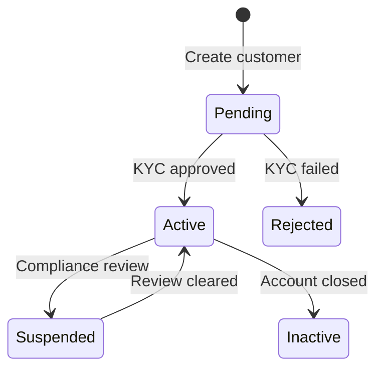

## Introduction

Customers represent end-users of your platform. Each customer can:
- Hold balances in BRL, USDT, and BTC
- Execute trades between currencies
- Receive and send Pix payments
- Perform on-chain and Lightning transactions

## Customer types

Bipa supports two customer types for the Brazilian market:

<CardGroup cols={2}>
  <Card title="Individual (PF)" icon="user">
    Brazilian individuals identified by CPF. Suitable for retail users, freelancers, and sole proprietors.
  </Card>
  <Card title="Business (PJ)" icon="building">
    Brazilian companies identified by CNPJ. Requires legal representatives and additional documentation.
  </Card>
</CardGroup>

## Customer lifecycle



| Status | Description |
|--------|-------------|
| `pending` | Customer created, awaiting KYC verification |
| `active` | Fully verified and operational |
| `suspended` | Temporarily restricted (compliance review) |
| `rejected` | KYC verification failed |
| `inactive` | Account closed |

## The customer object

```json
{
  "id": "cus_a1b2c3d4e5f6",
  "type": "individual",
  "status": "active",
  "document": {
    "type": "cpf",
    "number": "***456789**"
  },
  "name": "João Silva",
  "email": "joao@example.com",
  "phone": "+5511999999999",
  "address": {
    "street": "Av. Paulista",
    "number": "1000",
    "complement": "Sala 101",
    "neighborhood": "Bela Vista",
    "city": "São Paulo",
    "state": "SP",
    "postal_code": "01310100"
  },
  "created_at": "2024-01-15T10:30:00Z",
  "updated_at": "2024-01-15T10:30:00Z"
}
```

### Attributes

| Attribute | Type | Description |
|-----------|------|-------------|
| `id` | string | Unique identifier with `cus_` prefix |
| `type` | string | `individual` or `business` |
| `status` | string | Current customer status |
| `document` | object | CPF/CNPJ document (partially masked) |
| `name` | string | Full name (individual) or trade name (business) |
| `email` | string | Contact email address |
| `phone` | string | Phone number in E.164 format |
| `address` | object | Brazilian address |
| `created_at` | string | ISO 8601 creation timestamp |
| `updated_at` | string | ISO 8601 last update timestamp |

## Endpoints

<CardGroup cols={2}>
  <Card title="Create Individual" icon="user-plus" href="/api-reference/customers/create-individual">
    Create a customer with CPF
  </Card>
  <Card title="Create Business" icon="building" href="/api-reference/customers/create-business">
    Create a customer with CNPJ
  </Card>
  <Card title="Get Customer" icon="magnifying-glass" href="/api-reference/customers/get-customer">
    Retrieve a customer by ID
  </Card>
  <Card title="List Customers" icon="list" href="/api-reference/customers/list-customers">
    List all customers
  </Card>
  <Card title="Update Customer" icon="pen" href="/api-reference/customers/update-customer">
    Update customer details
  </Card>
</CardGroup>

## KYC requirements

### Individual customers (PF)

| Field | Required | Description |
|-------|----------|-------------|
| `name` | Yes | Full legal name |
| `document.number` | Yes | Valid CPF (11 digits) |
| `email` | Yes | Valid email address |
| `phone` | Yes | Brazilian phone number |
| `birth_date` | Yes | Date of birth (18+ years) |
| `address` | Yes | Complete Brazilian address |

### Business customers (PJ)

| Field | Required | Description |
|-------|----------|-------------|
| `legal_name` | Yes | Registered company name |
| `trade_name` | No | Doing business as (DBA) |
| `document.number` | Yes | Valid CNPJ (14 digits) |
| `email` | Yes | Company email address |
| `phone` | Yes | Company phone number |
| `address` | Yes | Registered business address |
| `representatives` | Yes | At least one legal representative |

<Note>
  KYC verification typically completes within minutes for individuals and up to 24 hours for businesses.
</Note>

