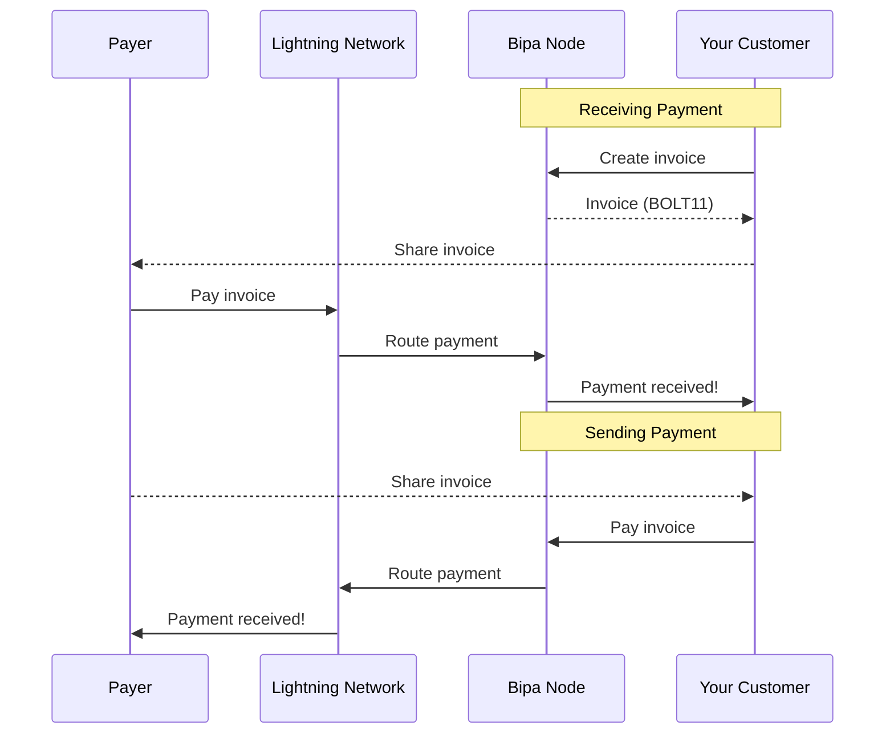

## Introduction

The Lightning Network is a layer-2 payment protocol on Bitcoin that enables instant, low-cost transactions. It's ideal for micropayments, remittances, and e-commerce checkout.

<CardGroup cols={2}>
  <Card title="Instant payments" icon="bolt">
    Transactions settle in seconds, not minutes
  </Card>
  <Card title="Minimal fees" icon="coins">
    Fractions of a cent per transaction
  </Card>
  <Card title="Micropayments" icon="droplet">
    Send as little as 1 satoshi (0.00000001 BTC)
  </Card>
  <Card title="Global reach" icon="globe">
    Send to any Lightning-enabled wallet worldwide
  </Card>
</CardGroup>

## How Lightning works



## Units

Lightning amounts are denominated in **satoshis** (sats):
- 1 BTC = 100,000,000 satoshis
- 1 satoshi = 0.00000001 BTC

Common amounts:
| Satoshis | BTC | Approx BRL* |
|----------|-----|-------------|
| 1,000 | 0.00001 | R$ 2.13 |
| 10,000 | 0.0001 | R$ 21.30 |
| 100,000 | 0.001 | R$ 213.00 |
| 1,000,000 | 0.01 | R$ 2,130.00 |

*At BTC = R$ 213,000

## The Lightning payment object

```json
{
  "id": "ln_pay_xyz789",
  "customer_id": "cus_a1b2c3d4e5f6",
  "type": "outbound",
  "payment_hash": "a1b2c3d4e5f6789012345678901234567890123456789012345678901234abcd",
  "payment_preimage": "f6e5d4c3b2a1098765432109876543210987654321098765432109876543dcba",
  "amount_sats": 100000,
  "fee_sats": 10,
  "status": "completed",
  "payment_request": "lnbc1m1pj...",
  "description": "Coffee payment",
  "created_at": "2024-01-15T10:30:00Z",
  "completed_at": "2024-01-15T10:30:01Z"
}
```

### Attributes

| Attribute | Type | Description |
|-----------|------|-------------|
| `id` | string | Unique payment identifier |
| `customer_id` | string | Customer associated with payment |
| `type` | string | `inbound` (received) or `outbound` (sent) |
| `payment_hash` | string | Unique hash identifying the payment |
| `payment_preimage` | string | Proof of payment (revealed on success) |
| `amount_sats` | integer | Amount in satoshis |
| `fee_sats` | integer | Routing fee paid (outbound only) |
| `status` | string | Payment status |
| `payment_request` | string | BOLT11 invoice string |
| `description` | string | Payment description |
| `created_at` | string | ISO 8601 timestamp |
| `completed_at` | string | ISO 8601 timestamp |

## Payment statuses

| Status | Description |
|--------|-------------|
| `pending` | Invoice created, awaiting payment |
| `completed` | Payment successfully completed |
| `failed` | Payment failed (routing error, timeout, etc.) |
| `expired` | Invoice expired without payment |

## Endpoints

<CardGroup cols={2}>
  <Card title="Create Invoice" icon="file-invoice" href="/api-reference/lightning/create-invoice">
    Generate an invoice to receive payments
  </Card>
  <Card title="Pay Invoice" icon="paper-plane" href="/api-reference/lightning/pay-invoice">
    Pay a Lightning invoice
  </Card>
  <Card title="Get Payment" icon="magnifying-glass" href="/api-reference/lightning/get-payment">
    Retrieve payment details
  </Card>
  <Card title="List Payments" icon="list" href="/api-reference/lightning/list-payments">
    List all Lightning payments
  </Card>
</CardGroup>

## Fees

### Receiving (inbound)
Free. No fees for receiving Lightning payments.

### Sending (outbound)
- **Bipa fee**: 0.1% of amount (minimum 1 sat)
- **Routing fee**: Dynamic, typically <0.1%

The `max_fee_sats` parameter lets you cap total fees.

## Limits

| Operation | Minimum | Maximum |
|-----------|---------|---------|
| Create invoice | 1 sat | 10,000,000 sats (0.1 BTC) |
| Pay invoice | 1 sat | 10,000,000 sats (0.1 BTC) |

<Note>
  For larger amounts, use on-chain Bitcoin transfers.
</Note>

## Webhooks

| Event | Description |
|-------|-------------|
| `lightning.invoice.paid` | Invoice was paid |
| `lightning.payment.completed` | Outgoing payment completed |
| `lightning.payment.failed` | Payment failed |

## Use cases

<AccordionGroup>
  <Accordion title="E-commerce checkout">
    Generate a Lightning invoice for each order. The customer scans the QR code with their wallet and pays instantly.
  </Accordion>
  <Accordion title="Micropayments">
    Enable pay-per-use features, tipping, or content monetization with payments as low as 1 satoshi.
  </Accordion>
  <Accordion title="Remittances">
    Send Bitcoin instantly to recipients anywhere in the world with minimal fees.
  </Accordion>
  <Accordion title="Gaming">
    Instant payouts for game rewards, tournament prizes, or in-game purchases.
  </Accordion>
</AccordionGroup>

