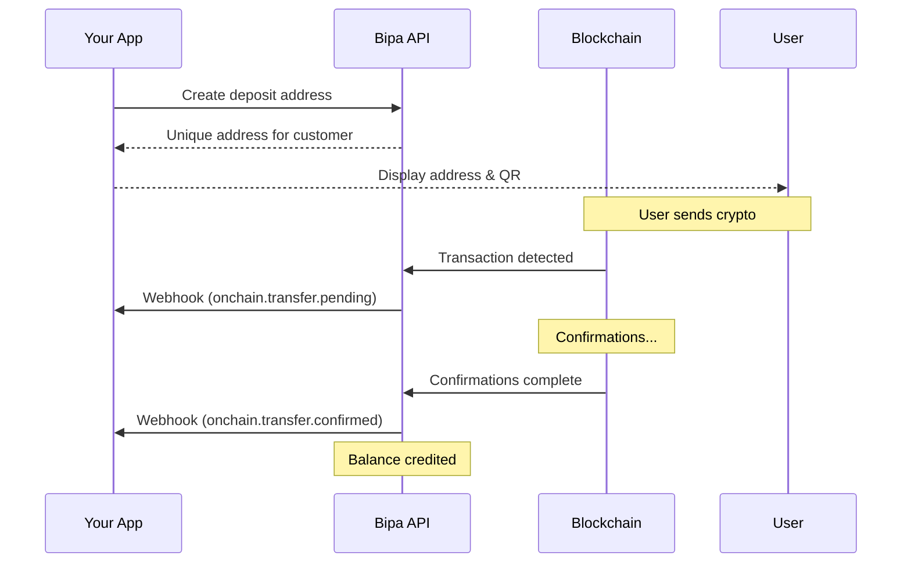
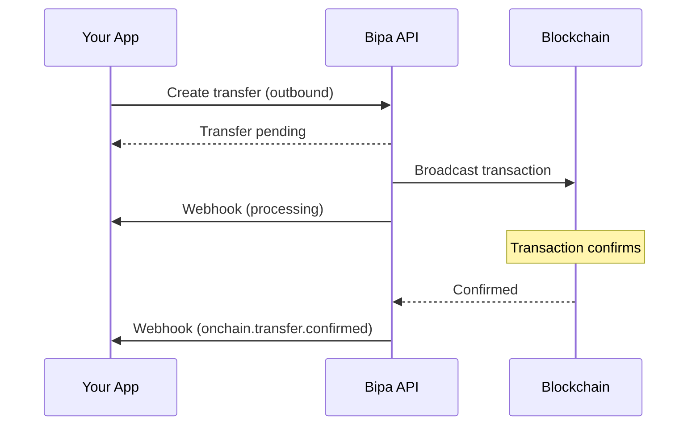

## Introduction

The On-chain Transfers API enables inbound and outbound transfers of cryptocurrencies via their native blockchain networks. Bipa manages hot wallets with institutional-grade security via Fireblocks.

<CardGroup cols={2}>
  <Card title="Multi-network USDT" icon="layer-group">
    Support for Ethereum, Polygon, Tron, Arbitrum, and Optimism
  </Card>
  <Card title="Bitcoin" icon="bitcoin">
    Native Bitcoin transfers on the Bitcoin network
  </Card>
  <Card title="Institutional custody" icon="shield">
    Multi-sig wallets secured by Fireblocks
  </Card>
  <Card title="Auto-conversion" icon="rotate">
    Optional auto-convert inbound transfers to BRL
  </Card>
</CardGroup>

## Supported assets & networks

### USDT

| Network | Confirmations | Inbound time | Outbound time |
|---------|---------------|--------------|---------------|
| Polygon | 128 blocks | ~5 minutes | ~2 minutes |
| Arbitrum | 64 blocks | ~2 minutes | ~1 minute |
| Optimism | 64 blocks | ~2 minutes | ~1 minute |
| Tron | 20 blocks | ~1 minute | ~1 minute |
| Ethereum | 12 blocks | ~3 minutes | ~3 minutes |

### Bitcoin

| Network | Confirmations | Inbound time | Outbound time |
|---------|---------------|--------------|---------------|
| Bitcoin | 3 blocks | ~30 minutes | ~10-60 minutes |

<Note>
  Polygon and Arbitrum are recommended for USDT due to lower fees and faster confirmations.
</Note>

## The transfer object

```json
{
  "id": "txn_abc123xyz",
  "customer_id": "cus_a1b2c3d4e5f6",
  "direction": "inbound",
  "asset": "USDT",
  "network": "polygon",
  "amount_gross": "100000000",
  "amount_net": "100000000",
  "fee": "0",
  "decimals": 6,
  "status": "confirmed",
  "address": "0x1234567890abcdef1234567890abcdef12345678",
  "tx_hash": "0xabcdef1234567890abcdef1234567890abcdef1234567890abcdef1234567890",
  "confirmations": 128,
  "confirmations_required": 128,
  "created_at": "2024-01-15T10:30:00Z",
  "confirmed_at": "2024-01-15T10:35:00Z"
}
```

### Attributes

| Attribute | Type | Description |
|-----------|------|-------------|
| `id` | string | Unique transfer identifier |
| `customer_id` | string | Customer who owns the transfer |
| `direction` | string | `inbound` or `outbound` |
| `asset` | string | `USDT` or `BTC` |
| `network` | string | Blockchain network |
| `amount_gross` | string | Total amount in smallest unit (for outbound: net + fee) |
| `amount_net` | string | Net amount in smallest unit (credited/received) |
| `fee` | string | Network fee in smallest unit (0 for inbound) |
| `decimals` | integer | Decimal places for the asset (6 for USDT, 8 for BTC) |
| `status` | string | Transfer status |
| `address` | string | Deposit address (inbound only) |
| `destination_address` | string | Recipient address (outbound only) |
| `tx_hash` | string | Transaction hash |
| `confirmations` | integer | Current confirmations |
| `confirmations_required` | integer | Required confirmations |
| `created_at` | string | ISO 8601 timestamp |
| `confirmed_at` | string | ISO 8601 confirmation timestamp |

## Transfer statuses

| Status | Description |
|--------|-------------|
| `pending` | Waiting for transaction to be broadcast |
| `processing` | Transaction broadcast, awaiting confirmations |
| `confirmed` | Required confirmations reached, credited/sent |
| `failed` | Transfer failed |

## Inbound transfer flow



## Outbound transfer flow



## Endpoints

<CardGroup cols={2}>
  <Card title="Create Deposit Address" icon="wallet" href="/api-reference/onchain/create-deposit-address">
    Create an address to receive inbound transfers
  </Card>
  <Card title="Create Transfer" icon="arrow-up-from-bracket" href="/api-reference/onchain/create-transfer">
    Create an outbound transfer to external address
  </Card>
  <Card title="Get Transfer" icon="magnifying-glass" href="/api-reference/onchain/get-transfer">
    Retrieve transfer details
  </Card>
  <Card title="List Transfers" icon="list" href="/api-reference/onchain/list-transfers">
    List all on-chain transfers
  </Card>
</CardGroup>

## Fees

### Inbound fees
Inbound transfers (deposits) are free. Bipa covers network fees for incoming transactions.

### Outbound fees

| Asset | Network | Fee |
|-------|---------|-----|
| USDT | Polygon | 1 USDT |
| USDT | Arbitrum | 1 USDT |
| USDT | Optimism | 1 USDT |
| USDT | Tron | 1 USDT |
| USDT | Ethereum | 3-25 USDT (dynamic) |
| BTC | Bitcoin | Dynamic (based on mempool) |

<Note>
  Bitcoin transfers are always sent with fast priority. Fees vary based on network congestion and are shown before confirmation.
</Note>

## Amount encoding

All monetary amounts are returned as **string-encoded integers** in the asset's smallest unit to avoid floating-point precision issues. This is the industry standard for financial and blockchain APIs.

### Decimal places by asset

| Asset | Decimals | Smallest unit | Example |
|-------|----------|---------------|---------|
| USDT | 6 | 0.000001 USDT | `"100000000"` = 100 USDT |
| BTC | 8 | 1 satoshi | `"1000000"` = 0.01 BTC |

<Warning>
  Never use floating-point types (`float`, `double`) for monetary calculations. Use arbitrary-precision libraries like `BigDecimal` (Java), `Decimal` (Python), `BigInt` (JavaScript), or `big.Int` (Go).
</Warning>

### Amount fields

For every transfer, four amount-related fields are returned:

| Field | Type | Description |
|-------|------|-------------|
| `amount_gross` | string | Total amount in smallest unit |
| `amount_net` | string | Net amount in smallest unit |
| `fee` | string | Fee in smallest unit |
| `decimals` | integer | Decimal places for the asset |

### Conversion examples

**USDT (6 decimals):**
```
API value: "100000000" (integer string)
Human value: 100.000000 USDT
Formula: 100000000 / 10^6 = 100 USDT
```

**BTC (8 decimals):**
```
API value: "1000000" (integer string)
Human value: 0.01000000 BTC
Formula: 1000000 / 10^8 = 0.01 BTC
```

### Code examples

<Tabs>
  <Tab title="JavaScript">
```javascript
// Using BigInt for precision (native, no dependencies)
function toHumanReadable(amountStr, decimals) {
  const amount = BigInt(amountStr);
  const divisor = BigInt(10 ** decimals);
  const whole = amount / divisor;
  const fraction = amount % divisor;
  return `${whole}.${fraction.toString().padStart(decimals, '0')}`;
}

function toSmallestUnit(humanAmount, decimals) {
  const [whole, fraction = ''] = humanAmount.split('.');
  const paddedFraction = fraction.padEnd(decimals, '0').slice(0, decimals);
  return BigInt(whole + paddedFraction).toString();
}

// Example
const transfer = await getTransfer('txn_abc123');
console.log(`Amount: ${toHumanReadable(transfer.amount_net, transfer.decimals)} USDT`);
// Output: "Amount: 100.000000 USDT"
```
  </Tab>
  <Tab title="Python">
```python
from decimal import Decimal

def to_human_readable(amount_str: str, decimals: int) -> Decimal:
    """Convert smallest unit to human-readable decimal."""
    return Decimal(amount_str) / Decimal(10 ** decimals)

def to_smallest_unit(human_amount: Decimal, decimals: int) -> str:
    """Convert human-readable decimal to smallest unit string."""
    return str(int(human_amount * Decimal(10 ** decimals)))

# Example
transfer = get_transfer('txn_abc123')
amount = to_human_readable(transfer['amount_net'], transfer['decimals'])
print(f"Amount: {amount} USDT")
# Output: "Amount: 100.000000 USDT"
```
  </Tab>
  <Tab title="Go">
```go
import (
    "math/big"
    "fmt"
)

func toHumanReadable(amountStr string, decimals int) string {
    amount := new(big.Int)
    amount.SetString(amountStr, 10)

    divisor := new(big.Int).Exp(big.NewInt(10), big.NewInt(int64(decimals)), nil)

    whole := new(big.Int).Div(amount, divisor)
    fraction := new(big.Int).Mod(amount, divisor)

    format := fmt.Sprintf("%%s.%%0%dd", decimals)
    return fmt.Sprintf(format, whole.String(), fraction.Int64())
}

// Example
transfer := getTransfer("txn_abc123")
fmt.Printf("Amount: %s USDT\n", toHumanReadable(transfer.AmountNet, transfer.Decimals))
// Output: "Amount: 100.000000 USDT"
```
  </Tab>
</Tabs>

### Outbound transfer example

When sending 100 USDT on Polygon (1 USDT fee):

| Field | Value | Human-readable |
|-------|-------|----------------|
| `amount_net` | `"100000000"` | 100.000000 USDT (recipient receives) |
| `fee` | `"1000000"` | 1.000000 USDT |
| `amount_gross` | `"101000000"` | 101.000000 USDT (deducted from balance) |
| `decimals` | `6` | — |

## Webhooks

| Event | Description |
|-------|-------------|
| `onchain.transfer.pending` | Transfer detected, awaiting confirmations |
| `onchain.transfer.confirmed` | Transfer confirmed and processed |
| `onchain.transfer.failed` | Transfer failed |
