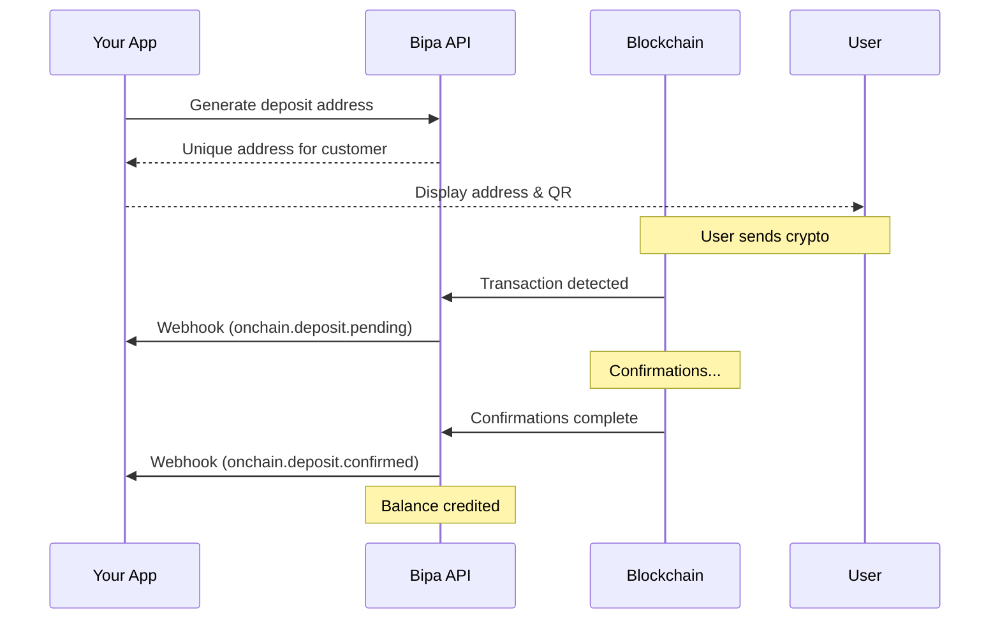

## Introduction

The On-chain Transfers API enables deposits and withdrawals of cryptocurrencies via their native blockchain networks. Bipa manages hot wallets with institutional-grade security via Fireblocks.

<CardGroup cols={2}>
  <Card title="Multi-network USDT" icon="layer-group">
    Support for Ethereum, Polygon, Tron, Arbitrum, and Optimism
  </Card>
  <Card title="Bitcoin" icon="bitcoin">
    Native Bitcoin deposits and withdrawals
  </Card>
  <Card title="Institutional custody" icon="shield">
    Multi-sig wallets secured by Fireblocks
  </Card>
  <Card title="Auto-conversion" icon="rotate">
    Optional auto-convert deposits to BRL
  </Card>
</CardGroup>

## Supported assets & networks

### USDT

| Network | Confirmations | Deposit time | Withdrawal time |
|---------|---------------|--------------|-----------------|
| Polygon | 128 blocks | ~5 minutes | ~2 minutes |
| Arbitrum | 64 blocks | ~2 minutes | ~1 minute |
| Optimism | 64 blocks | ~2 minutes | ~1 minute |
| Tron | 20 blocks | ~1 minute | ~1 minute |
| Ethereum | 12 blocks | ~3 minutes | ~3 minutes |

### Bitcoin

| Network | Confirmations | Deposit time | Withdrawal time |
|---------|---------------|--------------|-----------------|
| Bitcoin | 3 blocks | ~30 minutes | ~10-60 minutes |

<Note>
  Polygon and Arbitrum are recommended for USDT due to lower fees and faster confirmations.
</Note>

## The transfer object

```json
{
  "id": "txn_abc123xyz",
  "customer_id": "cus_a1b2c3d4e5f6",
  "type": "deposit",
  "asset": "USDT",
  "network": "polygon",
  "amount": "100.00",
  "fee": "0.00",
  "status": "confirmed",
  "address": "0x1234567890abcdef1234567890abcdef12345678",
  "tx_hash": "0xabcdef1234567890abcdef1234567890abcdef1234567890abcdef1234567890",
  "confirmations": 128,
  "confirmations_required": 128,
  "created_at": "2024-01-15T10:30:00Z",
  "confirmed_at": "2024-01-15T10:35:00Z"
}
```

### Attributes

| Attribute | Type | Description |
|-----------|------|-------------|
| `id` | string | Unique transfer identifier |
| `customer_id` | string | Customer who owns the transfer |
| `type` | string | `deposit` or `withdrawal` |
| `asset` | string | `USDT` or `BTC` |
| `network` | string | Blockchain network |
| `amount` | string | Transfer amount |
| `fee` | string | Network fee (for withdrawals) |
| `status` | string | Transfer status |
| `address` | string | Blockchain address |
| `tx_hash` | string | Transaction hash |
| `confirmations` | integer | Current confirmations |
| `confirmations_required` | integer | Required confirmations |
| `created_at` | string | ISO 8601 timestamp |
| `confirmed_at` | string | ISO 8601 confirmation timestamp |

## Transfer statuses

| Status | Description |
|--------|-------------|
| `pending` | Waiting for transaction to be broadcast |
| `processing` | Transaction broadcast, awaiting confirmations |
| `confirmed` | Required confirmations reached, credited |
| `failed` | Transfer failed |

## Deposit flow



## Withdrawal flow


## Endpoints

<CardGroup cols={2}>
  <Card title="Generate Deposit Address" icon="wallet" href="/api-reference/onchain/generate-deposit-address">
    Get a deposit address for a customer
  </Card>
  <Card title="Create Withdrawal" icon="arrow-up-from-bracket" href="/api-reference/onchain/create-withdrawal">
    Withdraw crypto to external address
  </Card>
  <Card title="Get Transfer" icon="magnifying-glass" href="/api-reference/onchain/get-transfer">
    Retrieve transfer details
  </Card>
  <Card title="List Transfers" icon="list" href="/api-reference/onchain/list-transfers">
    List all on-chain transfers
  </Card>
</CardGroup>

## Fees

### Deposit fees
Deposits are free. Bipa covers network fees for incoming transactions.

### Withdrawal fees

| Asset | Network | Fee |
|-------|---------|-----|
| USDT | Polygon | $0.50 |
| USDT | Arbitrum | $0.50 |
| USDT | Optimism | $0.50 |
| USDT | Tron | $1.00 |
| USDT | Ethereum | $5.00 + gas |
| BTC | Bitcoin | Dynamic (based on mempool) |

<Note>
  Bitcoin withdrawal fees vary based on network congestion. The fee is shown before confirmation.
</Note>

## Webhooks

| Event | Description |
|-------|-------------|
| `onchain.deposit.pending` | Deposit detected, awaiting confirmations |
| `onchain.deposit.confirmed` | Deposit confirmed and credited |
| `onchain.withdrawal.completed` | Withdrawal successfully sent |
| `onchain.withdrawal.failed` | Withdrawal failed |

