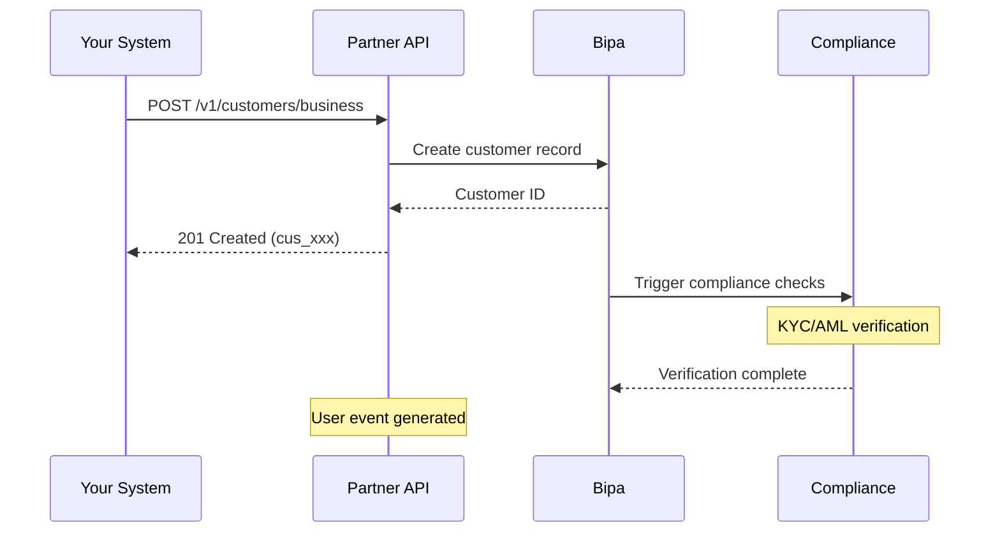

## Introduction

The Partner Customers API enables you to onboard business customers (companies) to the Bipa platform. Once onboarded, these customers can receive PIX payments and perform other financial operations through your integration.

<CardGroup cols={1}>
  <Card title="Create Business Customer" icon="building" href="/api-reference/partner/customers/create-business">
    Onboard a new business customer with full KYC
  </Card>
</CardGroup>

## Onboarding flow



## Customer identification

Business customers are identified by:

- **Customer ID**: Unique identifier prefixed with `cus_` (e.g., `cus_a1b2c3d4e5f6`)
- **CNPJ**: Brazilian company registration number (14 digits)

## Required information

To onboard a business customer, you need:

### Company information
- CNPJ (company registration)
- Legal name (razão social)
- Trade name (nome fantasia) - optional
- Email and phone
- Registered address

### Owner information
All partners with 25% or more ownership must be declared:

- Full name and social name
- CPF (individual tax ID)
- Contact information (email, phone)
- Date of birth
- Nationality and tax residence
- Address
- Ownership type (direct/indirect) and percentage

<Warning>
  Incomplete or inaccurate ownership information may delay or prevent account activation.
</Warning>

## Owner types

| Type | Description |
|------|-------------|
| `partner` | Company partner/shareholder |
| `representative` | Legal representative without ownership |
| `other_partner` | Other partner type |

## Ownership types

| Type | Description |
|------|-------------|
| `direct` | Direct, immediate ownership stake |
| `indirect` | Ownership through intermediary entities |

## Configuration options

When creating a business customer, you can configure automatic notifications:

| Option | Default | Description |
|--------|---------|-------------|
| `auto_send_owner_sms` | `false` | Send SMS verification to owners |
| `auto_send_owner_email` | `false` | Send email verification to owners |

## Metadata

You can attach custom key-value metadata to customers for your own tracking purposes:

```json
{
  "metadata": {
    "internal_id": "12345",
    "plan": "premium",
    "source": "referral"
  }
}
```

## Compliance and verification

After creation, customers undergo automatic compliance checks:

1. **Document validation** - CNPJ and CPF verification
2. **Sanctions screening** - AML/CFT checks
3. **Risk assessment** - Customer risk profiling

<Note>
  Business customers typically require additional verification and may take up to 24 hours to become fully active.
</Note>

## Events

Customer lifecycle events are available through the Events API:

| Event Kind | Description |
|------------|-------------|
| `opened` | Customer account created and activated |
| `closed` | Customer account closed |

See the [Events Overview](/api-reference/partner/events/overview) for details on event handling.
