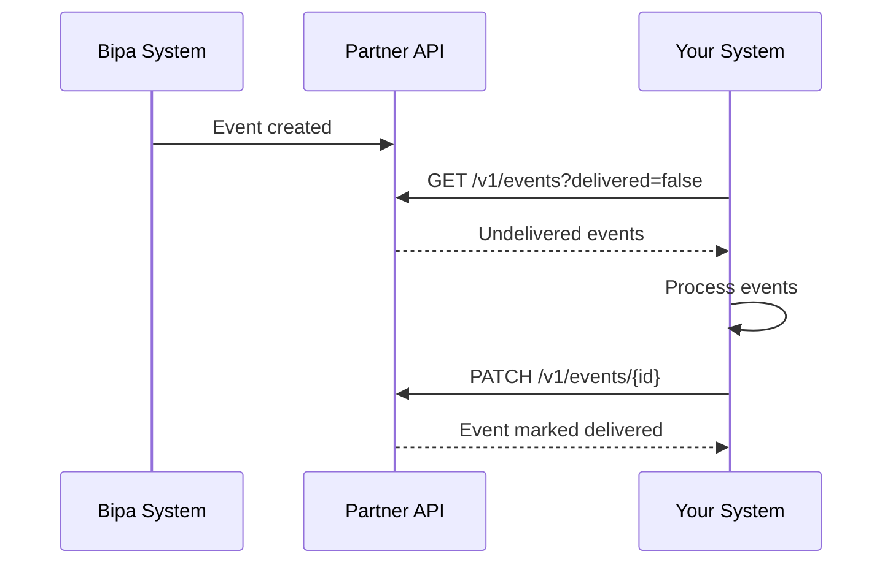

## Introduction

The Events API provides a way to track and manage infrastructure events that occur within your partner integration. Events are generated for key activities such as PIX key creation, PIX inflows, user account changes, and USDT withdrawals.

<CardGroup cols={2}>
  <Card title="List Events" icon="list" href="/api-reference/partner/events/list-events">
    Retrieve all events for your partner
  </Card>
  <Card title="Mark Delivered" icon="check" href="/api-reference/partner/events/mark-delivered">
    Mark an event as delivered
  </Card>
</CardGroup>

## Event types

| Kind | Description |
|------|-------------|
| `pix_key` | PIX key lifecycle events (created, registered, failed, canceled) |
| `pix_inflow` | Incoming PIX payment events (created, credited, failed) |
| `user` | User account events (opened, closed) |
| `usdt_withdrawal` | USDT withdrawal events (created, sent, settled, failed) |

## Event delivery model

Events are stored and made available through the API for you to poll. The `is_delivered` flag tracks whether you have processed each event.



<Tip>
  Poll for undelivered events regularly and mark them as delivered after successful processing to avoid reprocessing.
</Tip>

## The event object

```json
{
  "id": "550e8400-e29b-41d4-a716-446655440000",
  "kind": "pix_key",
  "created_at": 1705312200,
  "is_delivered": false,
  "log": {
    "id": "660e8400-e29b-41d4-a716-446655440001",
    "kind": "registered",
    "created_at": 1705312200,
    "key": "a1b2c3d4-e5f6-7890-abcd-ef1234567890",
    "tax_id": "***456789**",
    "timestamp": 1705312200
  }
}
```

### Event fields

| Field | Type | Description |
|-------|------|-------------|
| `id` | string | Unique event identifier (UUID) |
| `kind` | string | Event category: `pix_key`, `pix_inflow`, `user`, `usdt_withdrawal` |
| `created_at` | integer | Unix timestamp when event was created |
| `is_delivered` | boolean | Whether event has been marked as delivered |
| `log` | object | Event-specific payload (varies by kind) |

## Event log schemas

### PIX Key events

PIX key events track the lifecycle of a PIX key from creation through registration with BACEN.

#### State transitions

```
┌─────────────────────────────────────────────────────────────────┐
│                     PIX KEY LIFECYCLE                           │
├─────────────────────────────────────────────────────────────────┤
│                                                                 │
│       ┌─────────┐                                               │
│       │ created │  (request submitted to BACEN)                 │
│       └────┬────┘                                               │
│            │                                                    │
│            │ BACEN processing                                   │
│            │                                                    │
│       ┌────┴────────┐                                           │
│       ▼             ▼                                           │
│  ┌────────────┐  ┌────────┐                                     │
│  │ registered │  │ failed │                                     │
│  └─────┬──────┘  └────────┘                                     │
│        │                                                        │
│        │ user or system action                                  │
│        ▼                                                        │
│   ┌──────────┐                                                  │
│   │ canceled │                                                  │
│   └──────────┘                                                  │
│                                                                 │
│   Log sequence: created → registered | failed → canceled        │
│                                                                 │
└─────────────────────────────────────────────────────────────────┘
```

<Note>
  A PIX key can fail due to: key already claimed by another institution, invalid key format, or BACEN timeout/error.
</Note>

#### Log schema

```json
{
  "id": "uuid",
  "kind": "created|failed|registered|canceled",
  "created_at": 1705312200,
  "key": "pix-key-value",
  "tax_id": "***456789**",
  "timestamp": 1705312200
}
```

| Kind | Description |
|------|-------------|
| `created` | PIX key request created |
| `registered` | PIX key successfully registered with the network |
| `failed` | PIX key registration failed |
| `canceled` | PIX key was canceled/deleted |

### PIX Inflow events

PIX inflow events track incoming payments from when they're received to when they're credited to the user's account.

#### State transitions

```
┌─────────────────────────────────────────────────────────────────┐
│                    PIX INFLOW LIFECYCLE                         │
├─────────────────────────────────────────────────────────────────┤
│                                                                 │
│       ┌─────────┐                                               │
│       │ created │  (payment received from PIX network)          │
│       └────┬────┘                                               │
│            │                                                    │
│            │ internal processing                                │
│            │                                                    │
│       ┌────┴────┐                                               │
│       ▼         ▼                                               │
│  ┌──────────┐  ┌────────┐                                       │
│  │ credited │  │ failed │                                       │
│  └──────────┘  └────────┘                                       │
│                                                                 │
│   Log sequence: created → credited | failed                     │
│                                                                 │
└─────────────────────────────────────────────────────────────────┘
```

<Note>
  Inflows may fail due to: receiver account closed, compliance holds, or internal processing errors.
</Note>

#### Log schema

```json
{
  "id": "uuid",
  "kind": "created|credited|failed",
  "created_at": 1705312200,
  "amount_cents": 10000,
  "description": "Payment description",
  "end_to_end_id": "E12345678202401151030abcdef123456",
  "method": "dict",
  "receiver_tax_id": "***456789**",
  "sender_name": "John Doe",
  "sender_tax_id": "***123456**",
  "sender_account_number": "12345678",
  "sender_account_type": "checking",
  "sender_bank_code": "001",
  "sender_branch_code": "0001",
  "timestamp": 1705312200
}
```

| Kind | Description |
|------|-------------|
| `created` | Inflow payment initiated |
| `credited` | Payment successfully credited to user |
| `failed` | Payment processing failed |

### User events

User events track account lifecycle changes.

#### State transitions

```
┌─────────────────────────────────────────────────────────────────┐
│                     USER ACCOUNT LIFECYCLE                      │
├─────────────────────────────────────────────────────────────────┤
│                                                                 │
│       ┌────────┐                                                │
│       │ opened │  (KYC approved, account created)               │
│       └────┬───┘                                                │
│            │                                                    │
│            │ user request or compliance action                  │
│            ▼                                                    │
│       ┌────────┐                                                │
│       │ closed │                                                │
│       └────────┘                                                │
│                                                                 │
│   Log sequence: opened → closed                                 │
│                                                                 │
└─────────────────────────────────────────────────────────────────┘
```

#### Log schema

```json
{
  "id": "uuid",
  "kind": "opened|closed",
  "created_at": 1705312200,
  "tax_id": "***456789**",
  "account_branch_code": "0001",
  "account_full_number": 12345678,
  "account_digit": 9,
  "timestamp": 1705312200
}
```

| Kind | Description |
|------|-------------|
| `opened` | User account opened |
| `closed` | User account closed |

### USDT Withdrawal events

USDT withdrawal events track the full lifecycle of a withdrawal from request through blockchain confirmation.

#### State transitions

```
┌─────────────────────────────────────────────────────────────────┐
│                   USDT WITHDRAWAL LIFECYCLE                     │
├─────────────────────────────────────────────────────────────────┤
│                                                                 │
│       ┌─────────┐                                               │
│       │ created │  (withdrawal requested)                       │
│       └────┬────┘                                               │
│            │                                                    │
│       ┌────┴────┐                                               │
│       ▼         ▼                                               │
│   ┌────────┐  ┌────────┐                                        │
│   │  sent  │  │ failed │  (insufficient balance, invalid addr)  │
│   └────┬───┘  └────────┘                                        │
│        │                                                        │
│        │ blockchain tx broadcast (tx_hash available)            │
│        │                                                        │
│   ┌────┴────┐  awaiting confirmations                           │
│   ▼         ▼                                                   │
│  ┌─────────┐  ┌────────┐                                        │
│  │ settled │  │ failed │  (tx reverted, gas issues)             │
│  └─────────┘  └────────┘                                        │
│                                                                 │
│   Log sequence: created → sent → settled | failed               │
│                                                                 │
└─────────────────────────────────────────────────────────────────┘
```

<Note>
  Withdrawals can fail at different stages: before broadcast (insufficient balance, invalid address) or after broadcast (transaction reverted, gas issues, network congestion timeout).
</Note>

#### Log schema

```json
{
  "id": "uuid",
  "kind": "created|sent|settled|failed",
  "created_at": 1705312200,
  "tax_id": "***456789**",
  "amount_usdtmicros": 100000000,
  "blockchain_address": "0xabcdef1234567890abcdef1234567890abcdef12",
  "network": "polygon",
  "tx_hash": "0x123abc...",
  "timestamp": 1705312200
}
```

| Kind | Description |
|------|-------------|
| `created` | Withdrawal request created |
| `sent` | Transaction broadcast to blockchain |
| `settled` | Transaction confirmed on blockchain |
| `failed` | Withdrawal failed |

## Best practices

<AccordionGroup>
  <Accordion title="Poll regularly">
    Set up a scheduled job to poll for undelivered events every few minutes.
  </Accordion>
  <Accordion title="Process idempotently">
    Design your event handlers to be idempotent in case the same event is processed multiple times.
  </Accordion>
  <Accordion title="Mark delivered promptly">
    Mark events as delivered immediately after successful processing to avoid duplicates.
  </Accordion>
  <Accordion title="Handle all event types">
    Implement handlers for all event types relevant to your integration.
  </Accordion>
</AccordionGroup>
