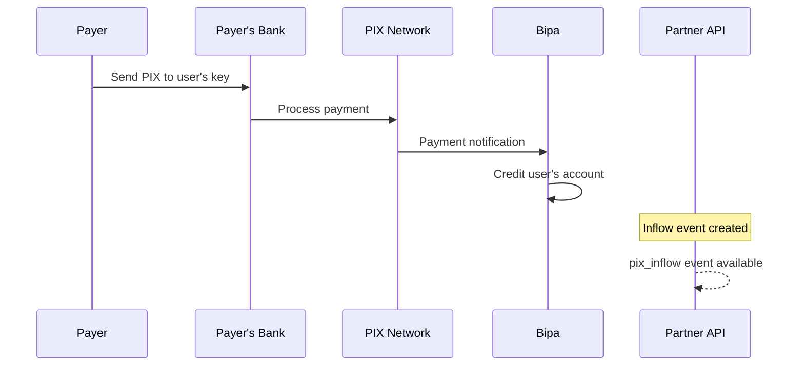

## Introduction

PIX Inflows represent incoming PIX payments received by your partner users. When someone sends a PIX payment to one of your user's PIX keys, it creates an inflow record that you can query through this API.

<CardGroup cols={1}>
  <Card title="List Inflows" icon="list" href="/api-reference/partner/pix-in/list-inflows">
    Retrieve all PIX inflows for your partner users
  </Card>
</CardGroup>

## How PIX inflows work



## The PIX inflow object

```json
{
  "amount_cents": 10000,
  "description": "Payment for services",
  "end_to_end_id": "E12345678202401151030abcdef123456",
  "method": "dict",
  "sender_name": "Maria Santos",
  "sender_tax_id": "***123456**",
  "sender_account_number": "12345678",
  "sender_account_type": "checking",
  "sender_bank_code": "001",
  "sender_branch_code": "0001",
  "created_at": 1705312200,
  "last_updated_at": 1705312205,
  "status": "credited"
}
```

### Inflow fields

| Field | Type | Description |
|-------|------|-------------|
| `amount_cents` | integer | Payment amount in centavos (BRL smallest unit) |
| `description` | string | Payment description (may be null) |
| `end_to_end_id` | string | Unique PIX transaction identifier |
| `method` | string | How the payment was initiated |
| `sender_name` | string | Payer's name |
| `sender_tax_id` | string | Payer's CPF/CNPJ (partially masked) |
| `sender_account_number` | string | Payer's account number |
| `sender_account_type` | string | Payer's account type |
| `sender_bank_code` | string | Payer's bank ISPB code |
| `sender_branch_code` | string | Payer's bank branch code |
| `created_at` | integer | Unix timestamp when inflow was created |
| `last_updated_at` | integer | Unix timestamp of last status change |
| `status` | string | Current inflow status |

## Payment methods

| Method | Description |
|--------|-------------|
| `manual` | Manual key entry |
| `dict` | PIX key lookup (DICT) |
| `static_qr_code` | Static QR code scan |
| `dynamic_qr_code` | Dynamic QR code scan |
| `payer_qr_code` | QR code generated by payer |
| `initiator` | Payment initiated by third party |

## Account types

| Type | Description |
|------|-------------|
| `checking` | Checking account (conta corrente) |
| `savings` | Savings account (conta poupança) |
| `salary` | Salary account (conta salário) |
| `payment` | Payment account (conta de pagamento) |

## Inflow statuses

| Status | Description |
|--------|-------------|
| `processing` | Payment being processed |
| `approved` | Payment approved by the network |
| `denied` | Payment was denied |
| `success` | Payment successful |
| `credited` | Funds credited to user's account |
| `failed` | Payment processing failed |

<Note>
  The final successful state is `credited`, indicating that the funds have been added to the user's balance.
</Note>

## Amount encoding

Amounts are represented as integers in **centavos** (BRL smallest unit):

| Amount | Value |
|--------|-------|
| R$ 1.00 | `100` |
| R$ 10.00 | `1000` |
| R$ 100.00 | `10000` |
| R$ 1,000.00 | `100000` |

<Warning>
  Always use integer arithmetic when handling monetary values. Never use floating-point types.
</Warning>

## Events

PIX inflows generate events that you can track via the Events API:

| Event Kind | Description |
|------------|-------------|
| `created` | Inflow payment initiated |
| `credited` | Funds successfully credited |
| `failed` | Payment processing failed |

See the [Events Overview](/api-reference/partner/events/overview) for details on event handling.
