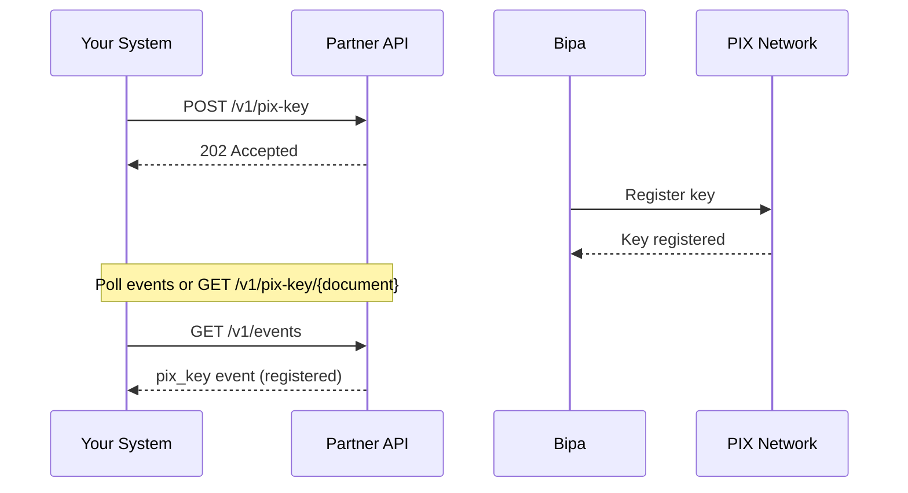

## Introduction

PIX keys are unique identifiers that allow users to receive instant payments through Brazil's PIX network. The Partner API enables you to create, retrieve, and delete PIX keys on behalf of your users.

<CardGroup cols={2}>
  <Card title="Create PIX Key" icon="plus" href="/api-reference/partner/pix-keys/create-pix-key">
    Request a new PIX key for a user
  </Card>
  <Card title="Get PIX Key" icon="magnifying-glass" href="/api-reference/partner/pix-keys/get-pix-key">
    Retrieve an existing PIX key
  </Card>
  <Card title="Delete PIX Key" icon="trash" href="/api-reference/partner/pix-keys/delete-pix-key">
    Remove a user's PIX key
  </Card>
</CardGroup>

## How PIX keys work

## PIX key types

Partner users receive **EVP (random) keys** - randomly generated UUIDs that provide privacy as they don't expose personal information.

| Type | Format | Example |
|------|--------|---------|
| `evp` | UUID | `a1b2c3d4-e5f6-7890-abcd-ef1234567890` |

<Note>
  Random keys (EVP) are recommended for privacy as they don't expose personal information like CPF, email, or phone.
</Note>

## User identification

All PIX key operations identify users by their **document** (CPF or CNPJ):

- **CPF**: 11-digit individual taxpayer number
- **CNPJ**: 14-digit business registration number

Documents can be provided formatted or unformatted:
- `123.456.789-00` or `12345678900` (CPF)
- `12.345.678/0001-99` or `12345678000199` (CNPJ)

## Lifecycle states

| Status | Description |
|--------|-------------|
| `accepted` | Request received, key registration in progress |
| `registered` | Key successfully registered and active |
| `failed` | Key registration failed |
| `canceled` | Key has been deleted |

## Idempotency

The create and delete operations support idempotency keys. If you retry a request with the same idempotency key:

- **Create**: Returns `already_exists` if the key was already created
- **Delete**: Returns `already_sent` or `succeeded` based on current state

<Tip>
  Always use idempotency keys to safely handle network failures and retries without creating duplicate keys.
</Tip>

## Events

PIX key operations generate events that you can track via the Events API:

| Event Kind | Description |
|------------|-------------|
| `created` | PIX key request submitted |
| `registered` | PIX key active and ready to receive payments |
| `failed` | PIX key registration failed |
| `canceled` | PIX key was deleted |

See the [Events Overview](/api-reference/partner/events/overview) for details on event handling.
