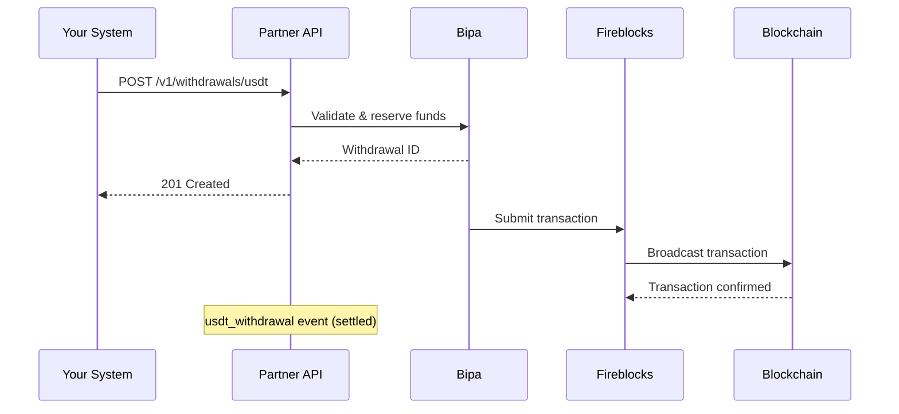

## Introduction

The USDT Withdrawals API enables you to initiate USDT withdrawals from your partner users' balances to external blockchain addresses. Withdrawals are processed through Fireblocks infrastructure for secure blockchain transactions.

<CardGroup cols={1}>
  <Card title="Create Withdrawal" icon="arrow-up-from-bracket" href="/api-reference/partner/withdrawals/create-withdrawal">
    Initiate a USDT withdrawal to a blockchain address
  </Card>
</CardGroup>

## How withdrawals work



## Supported networks

| Network | Code | Description |
|---------|------|-------------|
| Ethereum | `ETH` | Ethereum mainnet (ERC-20 USDT) |
| Polygon | `MATIC` | Polygon mainnet (PoS) |

<Note>
  Network fees vary significantly. Polygon offers much lower fees compared to Ethereum mainnet.
</Note>

## Fee structure

Withdrawals include a blockchain network fee based on the selected fee priority:

| Priority | Code | Description |
|----------|------|-------------|
| Low | `LOW` | Safe/standard gas price - slower but cheaper |
| Medium | `MEDIUM` | Proposed gas price - balanced speed and cost |
| High | `HIGH` | Fast gas price - fastest confirmation |

<Warning>
  Ethereum fees can be significantly higher during network congestion. Consider using Polygon for lower fees.
</Warning>

## Amount encoding

USDT amounts are specified in **micros** (6 decimal places):

| USDT Amount | Micros Value |
|-------------|--------------|
| 1 USDT | `1000000` |
| 10 USDT | `10000000` |
| 100 USDT | `100000000` |
| 1,000 USDT | `1000000000` |

## Address validation

The API validates blockchain addresses before processing:

- **Ethereum/Polygon**: Valid EVM address format (0x followed by 40 hex characters)
- Checksum validation is performed

Example valid address:
```
0xabcdef1234567890abcdef1234567890abcdef12
```

<Warning>
  Always verify the destination address with your user before submitting a withdrawal. Transactions to incorrect addresses cannot be reversed.
</Warning>

## Withdrawal statuses

| Status | Description |
|--------|-------------|
| `created` | Withdrawal request created, pending processing |
| `sent` | Transaction broadcast to blockchain |
| `settled` | Transaction confirmed on blockchain |
| `failed` | Withdrawal failed |

## Idempotency

Withdrawal requests support idempotency keys to safely handle retries:

- If a request with the same idempotency key already exists, the API returns `200 OK` with the existing withdrawal ID
- Use UUIDs for idempotency keys

<Tip>
  Always use idempotency keys for withdrawal requests to prevent accidental duplicate withdrawals.
</Tip>

## Events

Withdrawal lifecycle events are available through the Events API:

| Event Kind | Description |
|------------|-------------|
| `created` | Withdrawal request created |
| `sent` | Transaction broadcast to blockchain |
| `settled` | Transaction confirmed |
| `failed` | Withdrawal failed |

The event includes the `tx_hash` once the transaction is broadcast.

See the [Events Overview](/api-reference/partner/events/overview) for details on event handling.

## Security considerations

<AccordionGroup>
  <Accordion title="Address verification">
    Always confirm the destination address with your user through a secure channel before initiating a withdrawal.
  </Accordion>
  <Accordion title="Amount limits">
    Be aware of minimum withdrawal amounts and any limits configured for your partner account.
  </Accordion>
  <Accordion title="Network selection">
    Ensure your user's receiving wallet supports the selected network. Sending USDT on the wrong network may result in lost funds.
  </Accordion>
  <Accordion title="Idempotency">
    Always use idempotency keys to prevent duplicate withdrawals in case of network issues or retries.
  </Accordion>
</AccordionGroup>
