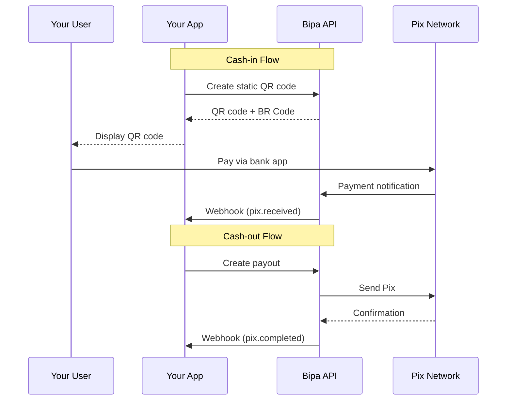

## Introduction

Pix is Brazil's instant payment system, enabling 24/7 transfers that complete in seconds. Bipa operates as a Payment Institution with indirect Pix participation, providing:

- **Instant settlements** - Payments complete in under 10 seconds
- **24/7 availability** - Works any time, including weekends and holidays
- **Zero fees for receiving** - No cost to receive Pix payments
- **Multiple key types** - Support for CPF, CNPJ, email, phone, and random keys

<CardGroup cols={2}>
  <Card title="Receive payments" icon="arrow-down">
    Generate static QR codes for customers to receive BRL
  </Card>
  <Card title="Send payments" icon="arrow-up">
    Initiate instant Pix payouts to any Pix key
  </Card>
</CardGroup>

## How it works



## Pix key types

| Type | Format | Example |
|------|--------|---------|
| `evp` | Random UUID | `a1b2c3d4-e5f6-7890-abcd-ef1234567890` |

<Note>
  For now, customers will only be able to receive payments from Random keys (`evp`) or Static QR Codes (that also direct the payment to the Random key).
  Random keys are recommended for privacy as they don't expose personal information.
</Note>

## Amount encoding

All monetary amounts are returned as **string-encoded integers** in centavos (BRL smallest unit).

| Asset | Decimals | Example |
|-------|----------|---------|
| BRL | 2 | `"100000"` = R$ 1,000.00 |

<Warning>
  Never use floating-point types (`float`, `double`) for monetary calculations. Use arbitrary-precision libraries.
</Warning>

## Transaction statuses

| Status | Description |
|--------|-------------|
| `pending` | Transaction initiated, awaiting processing |
| `processing` | Transaction being processed by Pix network |
| `completed` | Transaction successfully completed |
| `failed` | Transaction failed (see error for details) |
| `refunded` | Transaction was refunded |

## The Pix transaction object

```json
{
  "id": "pix_abc123",
  "customer_id": "cus_a1b2c3d4e5f6",
  "direction": "outbound",
  "amount": "100000",
  "fee": "0",
  "decimals": 2,
  "status": "completed",
  "counterparty": {
    "name": "Maria Santos",
    "document": "***456***",
    "pix_key": "recipient@email.com",
    "bank_account": {
      "ispb_code": "341",
      "branch_number": "1234",
      "account_number": "1234567890",
      "account_type": "checking"
    }
  },
  "description": "Payment for services",
  "end_to_end_id": "E12345678202401151030abcdef123456",
  "idempotency_key": "pay_unique_123",
  "created_at": "2024-01-15T10:30:00Z",
  "completed_at": "2024-01-15T10:30:02Z"
}
```

## Endpoints

<CardGroup cols={2}>
  <Card title="List Pix Keys" icon="key" href="/api-reference/pix/list-keys">
    List a customer's Pix keys
  </Card>
  <Card title="Create Static QR Code" icon="qrcode" href="/api-reference/pix/create-static-qr-code">
    Generate a QR code for receiving (cash-in)
  </Card>
  <Card title="Create Payout" icon="paper-plane" href="/api-reference/pix/create-payout">
    Send a Pix payout (cash-out)
  </Card>
  <Card title="Get Transaction" icon="magnifying-glass" href="/api-reference/pix/get-transaction">
    Retrieve transaction details
  </Card>
  <Card title="List Transactions" icon="list" href="/api-reference/pix/list-transactions">
    List all Pix transactions
  </Card>
</CardGroup>

## Limits

| Operation | Minimum | Maximum |
|-----------|---------|---------|
| Pix payout | R$ 0.01 | R$ 15,000.00 per transaction |
| Daily outbound | - | Defined per customer |

<Tip>
  Contact us for higher limits on business accounts.
</Tip>

## Webhooks

Subscribe to these events to track Pix transaction lifecycle:

| Event | Description |
|-------|-------------|
| `pix.received` | Incoming payment received (cash-in) |
| `pix.completed` | Outgoing payout completed (cash-out) |
| `pix.failed` | Transaction failed |
