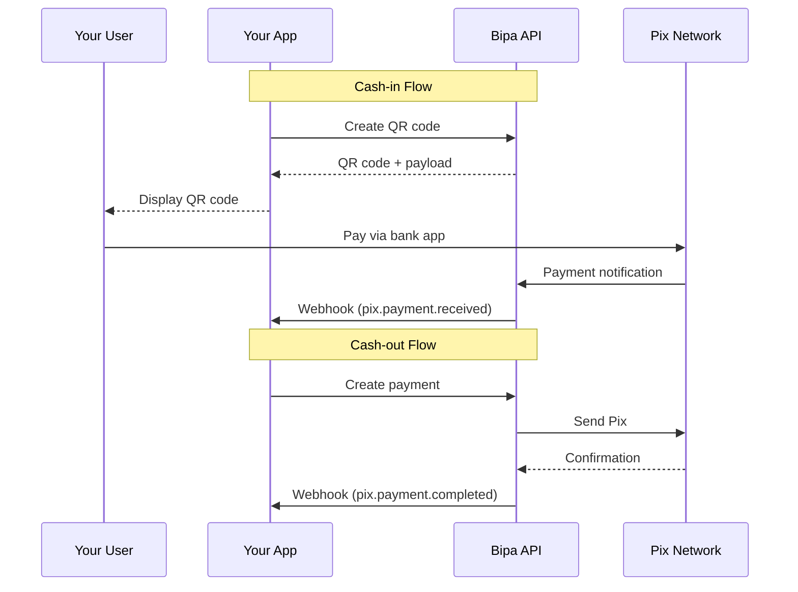

## Introduction

Pix is Brazil's instant payment system, enabling 24/7 transfers that complete in seconds. Bipa operates as a Payment Institution with indirect Pix participation, providing:

- **Instant settlements** - Payments complete in under 10 seconds
- **24/7 availability** - Works any time, including weekends and holidays
- **Zero fees for receiving** - No cost to receive Pix payments
- **Multiple key types** - Support for CPF, CNPJ, email, phone, and random keys

<CardGroup cols={2}>
  <Card title="Receive payments" icon="arrow-down">
    Generate Pix keys and QR codes for customers to receive BRL
  </Card>
  <Card title="Send payments" icon="arrow-up">
    Initiate instant Pix transfers to any Pix key
  </Card>
</CardGroup>

## How it works



## Pix key types

| Type | Format | Example |
|------|--------|---------|
| `evp` | Random UUID | `a1b2c3d4-e5f6-7890-abcd-ef1234567890` |
| `cpf` | 11 digits | `12345678900` |
| `cnpj` | 14 digits | `12345678000199` |
| `email` | Email address | `pagamentos@empresa.com.br` |
| `phone` | E.164 format | `+5511999999999` |

<Note>
  Random keys (`evp`) are recommended for privacy as they don't expose personal information.
</Note>

## Payment statuses

| Status | Description |
|--------|-------------|
| `pending` | Payment initiated, awaiting processing |
| `processing` | Payment being processed by Pix network |
| `completed` | Payment successfully completed |
| `failed` | Payment failed (see error for details) |
| `refunded` | Payment was refunded |

## The Pix payment object

```json
{
  "id": "pix_pay_abc123",
  "customer_id": "cus_a1b2c3d4e5f6",
  "direction": "outbound",
  "amount_cents": 100000,
  "fee_cents": 0,
  "status": "completed",
  "destination": {
    "type": "pix_key",
    "key": "recipient@email.com",
    "holder_name": "Maria Santos",
    "holder_document": "***456***"
  },
  "description": "Payment for services",
  "end_to_end_id": "E12345678202401151030abcdef123456",
  "idempotency_key": "pay_unique_123",
  "created_at": "2024-01-15T10:30:00Z",
  "completed_at": "2024-01-15T10:30:02Z"
}
```

## Endpoints

<CardGroup cols={2}>
  <Card title="Create Pix Key" icon="key" href="/api-reference/pix/create-pix-key">
    Register a Pix key for a customer
  </Card>
  <Card title="Create Payment" icon="paper-plane" href="/api-reference/pix/create-payment">
    Send a Pix payment (cash-out)
  </Card>
  <Card title="Create QR Code" icon="qrcode" href="/api-reference/pix/create-qr-code">
    Generate a QR code for receiving (cash-in)
  </Card>
  <Card title="Get Payment" icon="magnifying-glass" href="/api-reference/pix/get-payment">
    Retrieve payment details
  </Card>
  <Card title="List Payments" icon="list" href="/api-reference/pix/list-payments">
    List all Pix payments
  </Card>
</CardGroup>

## Limits

| Operation | Minimum | Maximum |
|-----------|---------|---------|
| Pix payment | R$ 0.01 | R$ 100,000.00 per transaction |
| Daily outbound | - | R$ 1,000,000.00 per customer |

<Tip>
  Contact us for higher limits on business accounts.
</Tip>

## Webhooks

Subscribe to these events to track Pix payment lifecycle:

| Event | Description |
|-------|-------------|
| `pix.payment.received` | Incoming payment received (cash-in) |
| `pix.payment.completed` | Outgoing payment completed (cash-out) |
| `pix.payment.failed` | Payment failed |

