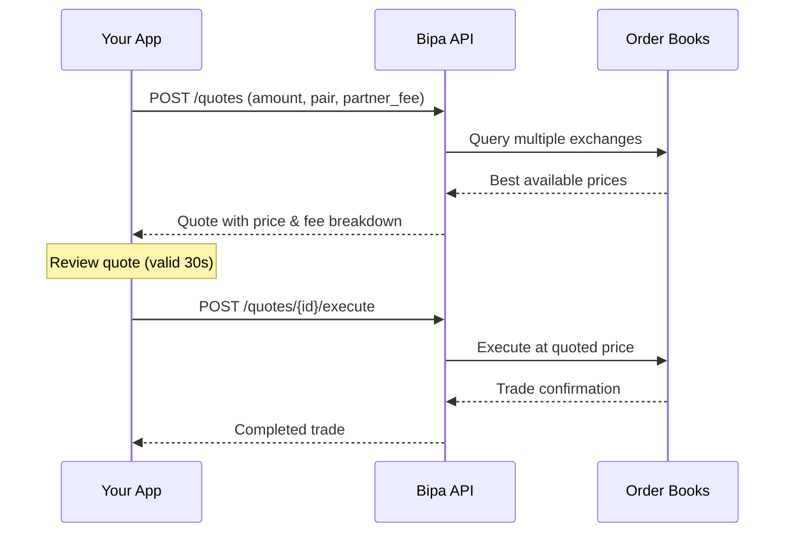

## Introduction

The Quotes API provides real-time pricing for currency conversions. Bipa's smart order router queries multiple exchange order books simultaneously to find the best available price.

<CardGroup cols={2}>
  <Card title="Flexible input" icon="arrows-left-right">
    Specify amount in source or target currency, net or gross
  </Card>
  <Card title="Transparent fees" icon="receipt">
    Clear breakdown of total, partner, and Bipa fees
  </Card>
  <Card title="Best execution" icon="chart-line">
    Smart routing across multiple exchanges
  </Card>
  <Card title="Partner revenue" icon="handshake">
    Set your own fee and earn on every conversion
  </Card>
</CardGroup>

## How it works



## Supported pairs

| From | To | Use case |
|------|-----|----------|
| `BRL` | `USDT` | Buy stablecoins with Brazilian Real |
| `USDT` | `BRL` | Sell stablecoins for Brazilian Real |
| `BRL` | `BTC` | Buy Bitcoin with Brazilian Real |
| `BTC` | `BRL` | Sell Bitcoin for Brazilian Real |
| `USDT` | `BTC` | Convert stablecoins to Bitcoin |
| `BTC` | `USDT` | Convert Bitcoin to stablecoins |

<Note>
  All BRL pairs settle instantly. Crypto-to-crypto pairs execute on-chain or via Lightning depending on amount.
</Note>

## The quote object

```json
{
  "id": "quote_abc123xyz",
  "customer_id": "cus_a1b2c3d4e5f6",
  "from_asset": "BRL",
  "to_asset": "BTC",
  "from_amount": "1005000",
  "to_amount": "25000",
  "from_decimals": 2,
  "to_decimals": 8,
  "price": "40200000000",
  "price_decimals": 2,
  "fees": {
    "total": "5000",
    "total_bps": 50,
    "partner": "2500",
    "partner_bps": 25,
    "bipa": "2500",
    "bipa_bps": 25
  },
  "status": "pending",
  "expires_at": "2024-01-15T10:30:30Z",
  "created_at": "2024-01-15T10:30:00Z"
}
```

### Attributes

| Attribute | Type | Description |
|-----------|------|-------------|
| `id` | string | Unique quote identifier |
| `customer_id` | string | Customer requesting the quote |
| `from_asset` | string | Source asset (`BRL`, `USDT`, `BTC`) |
| `to_asset` | string | Target asset (`BRL`, `USDT`, `BTC`) |
| `from_amount` | string | Amount debited from customer (smallest unit) |
| `to_amount` | string | Amount credited to customer (smallest unit) |
| `from_decimals` | integer | Decimal places for source asset |
| `to_decimals` | integer | Decimal places for target asset |
| `price` | string | Exchange price (1 unit of `to_asset` in `from_asset` smallest unit) |
| `price_decimals` | integer | Decimal places for price display |
| `fees` | object | Fee breakdown |
| `fees.total` | string | Total fee in `from_asset` smallest unit |
| `fees.total_bps` | integer | Total fee in basis points |
| `fees.partner` | string | Partner's fee portion in `from_asset` smallest unit |
| `fees.partner_bps` | integer | Partner fee in basis points |
| `fees.bipa` | string | Bipa's fee portion in `from_asset` smallest unit |
| `fees.bipa_bps` | integer | Bipa fee in basis points |
| `status` | string | Quote status |
| `expires_at` | string | ISO 8601 expiration timestamp |
| `created_at` | string | ISO 8601 creation timestamp |

## Amount encoding

All amounts use **integer strings in the smallest unit**:

| Asset | Decimals | Example |
|-------|----------|---------|
| BRL | 2 | `"100000"` = R$ 1,000.00 |
| USDT | 6 | `"100000000"` = 100 USDT |
| BTC | 8 | `"1000000"` = 0.01 BTC |

## Net vs Gross amounts

When requesting a quote, specify whether your amount is **net** or **gross**:

| Type | Description | Use case |
|------|-------------|----------|
| `net` | Amount the customer receives after fees | "I want exactly 0.001 BTC" |
| `gross` | Amount the customer pays before fees | "I want to spend exactly R$ 1,000" |

**Example: Buying BTC with R$ 1,000 (gross)**
```
Request: amount=100000, amount_type=gross
Result:  from_amount=100000 (R$ 1,000 paid)
         to_amount=24750   (0.0002475 BTC received)
         fees.total=500    (R$ 5 fee)
```

**Example: Buying exactly 0.001 BTC (net)**
```
Request: amount=100000, amount_type=net, amount_asset=BTC
Result:  from_amount=405000 (R$ 4,050 paid)
         to_amount=100000   (0.001 BTC received)
         fees.total=2025    (R$ 20.25 fee)
```

## Partner fees

Partners can set their own fee on each quote using `partner_fee_bps`. This fee is:
- Added to the total cost for the customer
- Split between the partner and Bipa (you keep your portion)
- Shown transparently in the `fees` object

```json
// Request with 1% partner fee (100 bps)
{
  "partner_fee_bps": 100
}

// Response shows the split
{
  "fees": {
    "total": "15000",      // R$ 150 total
    "total_bps": 150,
    "partner": "10000",    // R$ 100 partner earns
    "partner_bps": 100,
    "bipa": "5000",        // R$ 50 Bipa earns
    "bipa_bps": 50
  }
}
```

## Quote lifecycle

| State | Duration | Description |
|-------|----------|-------------|
| `pending` | 30 seconds | Quote can be executed |
| `expired` | After 30s | Must request a new quote |
| `executed` | - | Quote has been used for a trade |

<Warning>
  Quotes expire after **30 seconds** due to market volatility. Always execute promptly or request a fresh quote.
</Warning>

## Endpoints

<CardGroup cols={2}>
  <Card title="Create Quote" icon="calculator" href="/api-reference/quotes/create-quote">
    Get a real-time quote for a conversion
  </Card>
  <Card title="Execute Quote" icon="check" href="/api-reference/quotes/execute-quote">
    Execute a quote to complete the trade
  </Card>
</CardGroup>

## Limits

| Pair | Minimum | Maximum |
|------|---------|---------|
| BRL → USDT | R$ 10.00 | R$ 1,000,000.00 |
| USDT → BRL | 2 USDT | 200,000 USDT |
| BRL → BTC | R$ 10.00 | R$ 1,000,000.00 |
| BTC → BRL | 0.0001 BTC | 10 BTC |
| BTC ↔ USDT | 0.0001 BTC | 10 BTC |

<Tip>
  Contact us for higher limits on verified business accounts.
</Tip>
