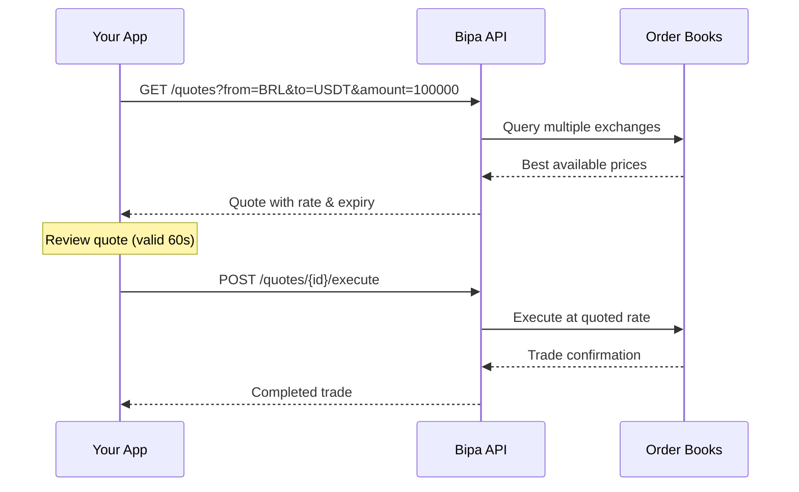

## Introduction

The Quotes API provides real-time pricing for currency conversions. Bipa's smart order router queries multiple exchange order books simultaneously to find the best available price.

<CardGroup cols={2}>
  <Card title="Best price execution" icon="chart-line">
    Smart routing across multiple exchanges for optimal rates
  </Card>
  <Card title="Transparent pricing" icon="eye">
    Clear breakdown of rates, fees, and spreads
  </Card>
</CardGroup>

## How it works



## Supported pairs

| From | To | Use case |
|------|-----|----------|
| `BRL` | `USDT` | Buy stablecoins with Brazilian Real |
| `USDT` | `BRL` | Sell stablecoins for Brazilian Real |
| `BRL` | `BTC` | Buy Bitcoin with Brazilian Real |
| `BTC` | `BRL` | Sell Bitcoin for Brazilian Real |
| `USDT` | `BTC` | Convert stablecoins to Bitcoin |
| `BTC` | `USDT` | Convert Bitcoin to stablecoins |

<Note>
  All BRL pairs settle instantly. Crypto-to-crypto pairs execute on-chain or via Lightning depending on amount.
</Note>

## The quote object

```json
{
  "id": "quote_abc123xyz",
  "from_currency": "BRL",
  "to_currency": "USDT",
  "from_amount_cents": 100000,
  "to_amount": "163.45",
  "rate": "6.1182",
  "rate_type": "mid_market",
  "spread_bps": 50,
  "fee_cents": 100,
  "expires_at": "2024-01-15T10:31:00Z",
  "created_at": "2024-01-15T10:30:00Z"
}
```

### Attributes

| Attribute | Type | Description |
|-----------|------|-------------|
| `id` | string | Unique quote identifier |
| `from_currency` | string | Source currency |
| `to_currency` | string | Target currency |
| `from_amount_cents` | integer | Amount to convert (in cents for BRL) |
| `to_amount` | string | Amount to receive (string for precision) |
| `rate` | string | Exchange rate applied |
| `rate_type` | string | Rate type (`mid_market`, `bid`, `ask`) |
| `spread_bps` | integer | Spread in basis points (100 bps = 1%) |
| `fee_cents` | integer | Fee in cents (BRL) |
| `expires_at` | string | Quote expiration timestamp |
| `created_at` | string | Quote creation timestamp |

## Quote lifecycle

| State | Duration | Description |
|-------|----------|-------------|
| Valid | 60 seconds | Quote can be executed |
| Expired | After 60s | Must request a new quote |
| Executed | - | Quote has been used for a trade |

<Warning>
  Quotes expire quickly due to market volatility. Always execute promptly or request a fresh quote.
</Warning>

## Endpoints

<CardGroup cols={2}>
  <Card title="Get Quote" icon="calculator" href="/api-reference/quotes/get-quote">
    Get a real-time quote for a currency pair
  </Card>
  <Card title="Execute Quote" icon="check" href="/api-reference/quotes/execute-quote">
    Execute a quote to complete the trade
  </Card>
</CardGroup>

## Pricing

| Component | Description |
|-----------|-------------|
| Mid-market rate | The current market rate from exchanges |
| Spread | Bipa's margin (typically 0.5% - 1%) |
| Fee | Fixed or percentage fee (shown in quote) |

The `to_amount` in the quote reflects the final amount after all fees and spreads.

## Limits

| Pair | Minimum | Maximum |
|------|---------|---------|
| BRL → USDT | R$ 1.00 | R$ 1,000,000.00 |
| USDT → BRL | $1.00 | $200,000.00 |
| BRL → BTC | R$ 1.00 | R$ 1,000,000.00 |
| BTC → BRL | 0.00001 BTC | 10 BTC |

<Tip>
  Contact us for higher limits on verified business accounts.
</Tip>

