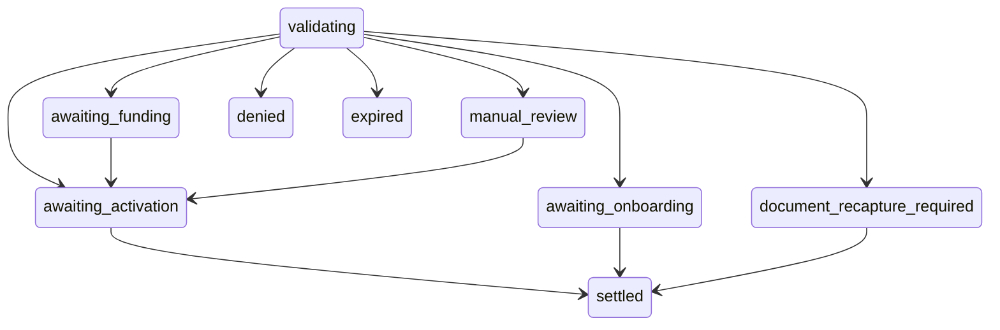

## Overview

An **originator** is a partner that brings people to Bipa. You submit one immutable envelope per person: their identity, the consents they gave you, optional KYC evidence you already hold, and optionally the balance they hold with you. Bipa verifies the person, creates or links their Bipa account, and, if you handed over a balance, moves it into their account once they activate.

The person becomes a Bipa customer. After the origination reaches a terminal state you see nothing further about them.

<Info>
  Originator keys reach only the origination endpoints and the events feed. The rest of the Partner API answers `404` to an originator key.
</Info>

## How it works

1. **Submit.** `POST /v1/originations` with the envelope. Bipa accepts it asynchronously and answers `201` with the current representation.
2. **Poll.** `GET /v1/originations/{id}` returns the state, the stage, the action you should take, and a `user_url` when the person has something to do.
3. **Read the terminal state.** `settled`, `denied`, or `expired`. Act on your own books and stop polling.

Bipa never asks you to confirm what you did on your side. Every movement of value happens on Bipa's ledger, from your Bipa account into a per-origination escrow and from the escrow into the person's account, or back to you.

## The envelope

The envelope is immutable. Retrying the same `external_id` with the same normalized content returns the existing origination with `200`; retrying it with different content is refused with `409 external_id_reused`.

| Field | Rules |
|---|---|
| `external_id` | 1 to 64 characters. Your identifier for this attempt. A new attempt after `denied` or `expired` uses a new value. |
| `tax_id` | `{ "type": "cpf", "value": "..." }`. 11 digits, no mask. `cnpj` answers `422 pj_not_supported` for now. |
| `email`, `phone` | A valid email, lowercased; a valid E.164 phone. If both belong to other people's Bipa accounts the submission is refused with `422 contact_conflict`; if only one does, the other becomes the person's login contact. |
| `consents.data_sharing`, `consents.bipa_terms` | Two separate proofs: `accepted_at` (RFC 3339, UTC), `ip`, `user_agent` (up to 512 characters), `document_version`, `document_digest_sha256` (64 hex characters of the rendered text), `locale` (BCP 47). |
| `kyc.level` | `basic` or `full`. |
| `kyc.selfie_file_url` | Required for `full`. A pre-signed HTTPS URL on the host you registered with Bipa. |
| `kyc.document_files` | Required and non-empty for `full`: at most one `front` and one `back`, each `{ "side", "file_url" }`. You do not tell us the document type; Bipa classifies it. |
| `balances` | The person's complete portfolio of non-zero positions, or an empty list. Each item is `{ asset, network, contract, decimal_scale, quantity }`, with `quantity` a string of digits in the asset's smallest unit. |
| `address` | Optional. When present every field is required except `complement`. |
| `bureau_blobs` | Optional. One item per `dataset` (`basic_data`, `processes`, `financial_data`, `kyc`), the provider's raw payload, up to 256 KiB each. |

Files must be JPEG or PNG, up to 10 MB, and the URLs must stay valid for at least 24 hours. Bipa copies them asynchronously. A file that cannot be used does not fail the submission; the person recaptures it inside Bipa.

The request body is limited to 4 MB. Above that the answer is `413` with no body.

## States, stages, and actions

Every representation carries a coarse `state`, a `stage`, and the `action_required` you should render.

| `state` | `stage` | `action_required` | Meaning |
|---|---|---|---|
| `pending` | `validating` | `none` | Bipa is working. Keep the balance frozen and keep polling. |
| `pending` | `awaiting_onboarding` | `standard_onboarding` | A basic-KYC person completes Bipa's normal onboarding through `user_url`. |
| `pending` | `manual_review` | `manual_review` | A compliance analyst is looking. Do not promise a timeline or a reason. |
| `pending` | `document_recapture_required` | `recapture_document` | The person recaptures their document and selfie through `user_url`. |
| `pending` | `awaiting_funding` | `fund_liquidity` | Your Bipa account is short of at least one asset. Nothing moved. Deposit, and Bipa retries. |
| `approved` | `awaiting_activation` | `activate` | The whole portfolio is reserved. The person activates through `user_url`. |
| `denied` | `terminal` | `denied` | Any reserved balance was already returned to your account. Release the person's balance on your side. |
| `expired` | `terminal` | `expired` | Same as denied. |
| `settled` | `terminal` | `settled` | The whole portfolio was credited to the person. Consume their balance on your side. |

Terminal states never change. The response never carries a fraud reason, a rule, a provider name, or whether the person already had a Bipa account.

## Deadlines

Every entry into a pending stage starts a 30-day deadline, and `awaiting_activation` starts a 30-day activation window. Always use `deadline_at` from the latest representation; do not compute it locally. A technical retry does not restart a clock. Expiry with a reserved balance returns the balance to your account before the state becomes `expired`.

## The user URL

`user_url` locates the origination for the person. It does not authenticate them. To act, the person signs in to Bipa with the same tax id, or completes Bipa's onboarding. A forwarded link cannot claim anything.

## Balances and funding

Balances you hand over are funded from your own Bipa account. When Bipa approves the person it reserves the complete portfolio in a per-origination escrow; when the person activates, the escrow settles into their account in one transaction. There is no partial settlement: an error, a shortfall, or a crash moves nothing or the whole portfolio.

Keep your Bipa account funded ahead of the portfolios you have submitted. An origination that finds your account short waits in `awaiting_funding` until the balance is there.

## Polling

Poll the `GET` every 5 to 15 seconds during the first minute, then back off to 60 seconds. `updated_at` lets you skip a response that did not change. A `404` means the id is unknown to your credential.

## Errors

| HTTP | `code` | When |
|---|---|---|
| `400` | `malformed_payload` | Invalid JSON, field, type, format, or combination. |
| `401` | | Missing or invalid key. |
| `403` | | Source IP outside your allowlist. |
| `404` | | Unknown id, or not yours. |
| `409` | `external_id_reused` | Same `external_id`, different envelope. |
| `409` | `origination_already_active` | This tax id already has a `pending` or `approved` origination. |
| `413` | | Body over 4 MB. |
| `422` | `pj_not_supported` | A CNPJ. |
| `422` | `contact_conflict` | Both contacts belong to other people's Bipa accounts. Nothing was stored; the person resolves it with Bipa support, then resubmit with a new `external_id`. |
| `422` | `unsupported_asset` | Asset, network, contract, or scale outside the launch registry. |
| `422` | `already_originated` | This tax id was already settled. |
| `429` | | Rate limit. Honor `Retry-After`. |
| `500` | `internal` | Internal failure, no sensitive detail. |
| `503` | `temporarily_unavailable` | Intake paused or a dependency down. Retry with backoff. |

Errors have the shape `{ "code": "..." }`.
