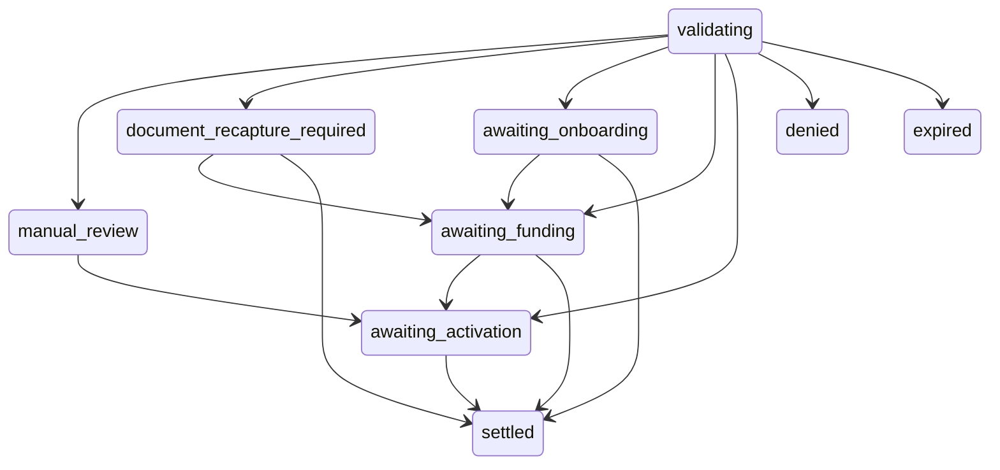

## Overview

An **originator** is a partner that brings people to Bipa. You submit one immutable envelope per person: their identity, the consents they gave you, optional KYC evidence you already hold, optional balances they hold with you, and optional trading history. Bipa verifies the person, creates or links their Bipa account, and settles the complete imported portfolio through the appropriate KYC path.

The person becomes a Bipa customer. After the origination reaches a terminal state you see nothing further about them.

<Info>
  Originator keys reach only the origination endpoints and the events feed. The rest of the Partner API answers `404` to an originator key.
</Info>

## How it works

1. **Submit.** `POST /v1/originations` with the envelope. Bipa stores it and answers `201` with the current representation; a two-contact conflict is created directly as a terminal denial.
2. **Poll.** `GET /v1/originations/{id}` returns the state, the stage, the action you should take, and a `user_url` when the person has something to do.
3. **Read the terminal state.** `settled`, `denied`, or `expired`. Act on your own books and stop polling.

Bipa never asks you to confirm what you did on your side. Every movement of value happens on Bipa's ledger, from your Bipa account through your originator’s shared escrow account into the person’s account, or back to you. Ledger records attribute each movement to its origination and asset.

## The envelope

The envelope is immutable. Retrying the same `external_id` with the same normalized content returns the existing origination with `200`; retrying it with different content is refused with `409 external_id_reused`.

| Field | Rules |
|---|---|
| `external_id` | 1 to 64 characters. Your identifier for this attempt. A new attempt after `denied` or `expired` uses a new value. |
| `tax_id` | `{ "type": "cpf", "value": "..." }`. 11 digits, no mask. `cnpj` answers `422 pj_not_supported` for now. |
| `email`, `phone` | A valid email, lowercased; a valid E.164 phone. If both belong to other people's Bipa accounts, Bipa stores the complete envelope and returns it immediately as `denied`; direct the person to Bipa support. If only one conflicts, the other becomes the person's login contact. |
| `consents.data_sharing`, `consents.terms_of_service` | Two separate proofs: `accepted_at` (RFC 3339, UTC), `ip`, `user_agent` (up to 512 characters), `document_version`, `document_digest_sha256` (64 hex characters of the rendered text), `locale` (BCP 47). |
| `kyc.level` | `basic` or `full`. |
| `kyc.selfie_file_url` | Required for `full`. A pre-signed HTTPS URL on the host you registered with Bipa. |
| `kyc.document_files` | Required and non-empty for `full`: at most one `front` and one `back`, each `{ "side", "file_url" }`. You do not tell us the document type; Bipa classifies it. |
| `balances` | The person's complete portfolio of non-zero positions, or an empty list. Each item is `{ asset, quantity }`, with `quantity` a string of digits in the asset's smallest unit. |
| `address` | Optional. When present every field is required except `complement`. |
| `bureau_blobs` | Optional. One item per `dataset` (`basic_data`, `processes`, `financial_data`, `kyc`), the provider's raw payload, up to 256 KiB each. |
| `trading_history` | Optional historical gross trading values in BRL cents, by asset and total. See [Trading history](#trading-history). |

Files must be JPEG or PNG, up to 10 MB, and the URLs must stay valid for at least 24 hours. Bipa copies them asynchronously. A file that cannot be used does not fail the submission; the person recaptures it inside Bipa.

The request body is limited to 4 MB. Above that the answer is `413` with no body.

## States, stages, and actions

Every representation carries a coarse `state`, a `stage`, and the `action_required` you should render.

| `state` | `stage` | `action_required` | Meaning |
|---|---|---|---|
| `pending` | `validating` | `none` | Bipa is working. Keep the balance frozen and keep polling. |
| `pending` | `awaiting_onboarding` | `standard_onboarding` | A basic-KYC person completes Bipa’s normal KYC through `user_url`. |
| `pending` | `manual_review` | `manual_review` | A compliance analyst is looking. Do not promise a timeline or a reason. |
| `pending` | `document_recapture_required` | `recapture_document` | The person recaptures their document and selfie through `user_url`. |
| `pending` | `awaiting_funding` | `fund_liquidity` | Your Bipa account is short of at least one asset. Nothing moved. Deposit, and Bipa retries. |
| `approved` | `awaiting_activation` | `activate` | The whole portfolio is reserved. The person activates through `user_url`. |
| `denied` | `terminal` | `denied` | Any reserved balance was already returned to your account. Release the person's balance on your side. |
| `expired` | `terminal` | `expired` | Same as denied. |
| `settled` | `terminal` | `settled` | The whole portfolio was credited to the person. Consume their balance on your side. |



Terminal states never change. The response never carries a fraud reason, a rule, a provider name, or whether the person already had a Bipa account.

## Deadlines

Every entry into a pending stage starts a 30-day deadline, and `awaiting_activation` starts a 30-day activation window. Always use `deadline_at` from the latest representation; do not compute it locally. A technical retry does not restart a clock. A replacement signup while funding is pending preserves the existing funding deadline. Expiry with a reserved balance returns the balance to your account before the state becomes `expired`.

## The user URL

`user_url` locates the origination for the person. It does not authenticate them. To act, the person signs in to Bipa with the same tax id, or completes Bipa’s normal KYC. A forwarded link cannot claim anything.

## Balances and funding

Each balance contains only `asset` and `quantity`. Bipa defines the units for each asset. Do not send `network`, `contract`, or `decimal_scale`; these unknown fields return `400 malformed_payload`.

| Asset | Decimal places |
|---|---|
| BRL | 2 |
| BTC | 8 |
| USDT | 6 |
| ETH | 18 |
| SOL | 9 |
| USDC | 6 |
| XRP | 6 |

`quantity` must be a positive integer string matching `^[1-9][0-9]*$`. For example, `"100000000"` means 1 BTC, and `"1000000"` means 1 USDT or 1 XRP. Do not send a JSON number, a decimal fraction, or a zero position.

Asset symbols are case-sensitive. An unsupported asset or duplicate position returns `422 unsupported_asset`. BNB is not supported. Submit the complete portfolio; do not omit an unsupported position to make the request pass.

Bipa selects the on-chain asset for the environment through its custody integration. You do not supply a token contract address in either sandbox or production.

Balances you hand over are funded from your own Bipa account. One escrow account belongs to your originator and holds reserved assets across customers; each origination has its own ledger references.

- **Full KYC:** after import pre-approval, Bipa reserves the complete portfolio in escrow. Successful account activation settles it into the customer's account. Denial or expiry returns any reserved assets to your account.
- **Basic KYC or document recapture:** Bipa does not reserve the portfolio at import pre-approval. Once the person completes normal KYC, account approval and the complete source → escrow → customer movement happen in one transaction. If any source asset is short, the origination waits in `awaiting_funding` and account approval waits too.

There is no partial portfolio settlement: a shortfall moves nothing, and an error rolls back account approval and the associated balance movements together.

Keep your Bipa account funded ahead of the portfolios you have submitted. An origination that finds your account short waits in `awaiting_funding` until the balance is there.

## Trading history

`trading_history` reports gross trading value, always in **BRL cents**. Asset entries identify what the person traded; their amounts are not native asset quantities. For example, `"100000"` means R$1,000.00 of traded value whether the entry is BTC, XRP, or another asset. Do not send `currency` or `decimal_scale`.

| Field | Rules |
|---|---|
| `as_of` | RFC 3339 in UTC. The exclusive end of every window. |
| `total` | Requires `last_3_months_cents`, `last_12_months_cents`, and `all_time_cents`. Each must equal the sum of that field across `assets`. |
| `assets` | A complete list of the reported traded assets. An empty list is valid only when all three totals are zero. |
| `assets[].asset` | 1–32 ASCII letters, digits, `.`, `_`, or `-`. Bipa normalizes letters to uppercase and rejects duplicates after normalization. History can include assets not supported in `balances`. |
| `assets[].last_3_months_cents`, `.last_12_months_cents`, `.all_time_cents` | Non-negative integer strings in BRL cents. JSON numbers, signs, fractions, exponents, whitespace, and leading zeros are rejected. `"0"` is valid. Maximum per value and sum: `170141183460469231731687303715884105727`. |

The same amount rules apply to `total`. For each asset and the total, `last_3_months_cents <= last_12_months_cents <= all_time_cents`.

The three- and twelve-month windows use calendar months and include their starting instant. Subtract the months from `as_of` while preserving the UTC time; if the day does not exist in the starting month, use that month's last day. `all_time_cents` includes all trades before `as_of` with your originator.

Gross trading value sums executed buys and sells before fees, valued in BRL at the time of each trade. Attribute each trade once to the traded asset; do not count its quote currency again. Exclude deposits, withdrawals, holdings, and profit. Do not omit an asset's activity from a reported total.

Omit `trading_history` or send `null` when history is unavailable. To report known zero activity, send all three totals as `"0"` and `assets: []`. Missing history and known zero are different. All fields are required when the object is present.

```json
{
  "trading_history": {
    "as_of": "2026-09-01T00:00:00Z",
    "total": {
      "last_3_months_cents": "1200000",
      "last_12_months_cents": "5000000",
      "all_time_cents": "9000000"
    },
    "assets": [
      { "asset": "BTC", "last_3_months_cents": "1000000", "last_12_months_cents": "4000000", "all_time_cents": "7000000" },
      { "asset": "XMR", "last_3_months_cents": "200000", "last_12_months_cents": "1000000", "all_time_cents": "2000000" }
    ]
  }
}
```

History is immutable with the envelope and stored encrypted. Changing it on a retry returns `409 external_id_reused`; reordering asset entries or changing symbol case does not change request identity. It is not returned in the origination status response. Reporting trading activity does not transfer those assets: transfers use `balances`.

## Polling

Poll the `GET` every 5 to 15 seconds during the first minute, then back off to 60 seconds. `updated_at` lets you skip a response that did not change. A `404` means the id is unknown to your credential.

## Errors

| HTTP | `code` | When |
|---|---|---|
| `400` | `malformed_payload` | Invalid JSON, field, type, format, or combination. |
| `401` | | Missing or invalid key. |
| `403` | | Source IP outside your allowlist. |
| `404` | | Unknown id, or not yours. |
| `409` | `external_id_reused` | Same `external_id`, different envelope. |
| `409` | `migration_already_active` | This tax id already has an active origination. `migration_id` identifies it when it belongs to your account. |
| `413` | | Body over 4 MB. |
| `422` | `pj_not_supported` | A CNPJ. |
| `422` | `unsupported_asset` | Unsupported asset, or a duplicate position. |
| `422` | `already_originated` | This tax id was already settled. |
| `429` | | Rate limit. Honor `Retry-After`. |
| `500` | `internal` | Internal failure, no sensitive detail. |
| `503` | `temporarily_unavailable` | Intake paused or a dependency down. Retry with backoff. |

Errors contain `code`. An active-migration conflict also includes `migration_id` when that migration belongs to your originator account:

```json
{
  "code": "migration_already_active",
  "migration_id": "01994622-86a0-7000-8000-000000000001"
}
```

Poll the returned ID instead of submitting a new migration. Conflicts with another originator omit the ID. An identical request with the original `external_id` still returns `200` with the existing migration.

A document that cannot be read or validated can require `document_recapture_required` or `manual_review`. These are nonterminal: Bipa handles customer recapture or review on the same migration. Continue polling that ID; do not create another import for that person. `denied` is a terminal rejection, distinct from a request for more evidence.

For controlled frontend tests, see [Sandbox migration examples](/api-reference/partner/originations/sandbox-examples).
