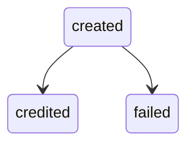

## Overview

A Pix Inflow represents an incoming Pix payment received by a user through their registered Pix Key. Inflows are initiated externally by a payer and processed asynchronously.

## Lifecycle

Pix Inflows are received asynchronously. When a payment arrives, you track its progress through event logs delivered to your webhook. Each state transition produces a `pix_inflow` event with a `PixInflowLog` payload.

## State Machine

## Log States

| State      | Description                                | Nullable fields                                          |
| ---------- | ------------------------------------------ | -------------------------------------------------------- |
| `created`  | Inflow received, pending processing.       | `amount_cents`, `method`, sender fields are `null`       |
| `credited` | Funds successfully credited to the user's account. | All fields present                                |
| `failed`   | Inflow processing failed.                  | `amount_cents`, `method`, sender fields may be `null`    |

## PixInflowLog Object

| Field                  | Type             | Description                                                                                          |
| ---------------------- | ---------------- | ---------------------------------------------------------------------------------------------------- |
| `id`                   | string (UUIDv7)  | Unique log identifier.                                                                               |
| `end_to_end_id`        | string           | Central Bank end-to-end identifier for the transaction.                                              |
| `receiver_user_id`     | string (UUIDv4)  | User who received the payment.                                                                       |
| `kind`                 | string           | Log state: `created`, `credited`, `failed`.                                                          |
| `amount_cents`         | integer or null  | Payment amount in cents (BRL).                                                                       |
| `method`               | string or null   | Inflow method: `dict`, `manual`, `static_qr_code`, `payer_qr_code`, `dynamic_qr_code`, `initiator`. |
| `sender_bank_code`     | string or null   | Sender's bank ISPB code.                                                                             |
| `sender_branch_code`   | string or null   | Sender's branch code.                                                                                |
| `sender_account_number`| string or null   | Sender's account number.                                                                             |
| `sender_account_type`  | string or null   | Sender's account type: `checking`, `savings`, `payment`, `salary`.                                   |
| `created_at`           | integer          | Unix timestamp when the log was created.                                                             |
| `timestamp`            | integer          | Unix timestamp of the state transition.                                                              |
