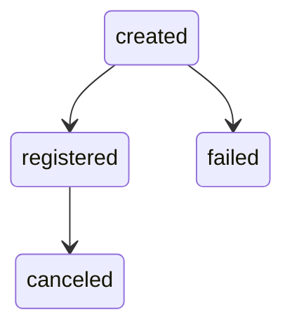

## Overview

A Pix Key is an EVP (Endereco Virtual de Pagamento) random key registered with the Brazilian Central Bank's DICT (Diretorio de Identificadores de Contas Transacionais). In the Bipa Infra context, each key is tied to a user and serves as an address for receiving Pix payments.

## Lifecycle

Pix Key operations are asynchronous. You request creation or deletion via the API, and track progress through event logs delivered to your webhook. Each state transition produces a `pix_key` event with a `PixKeyLog` payload.

## State Machine

## Log States

| State        | Description                                                                 | `key` field         |
| ------------ | --------------------------------------------------------------------------- | ------------------- |
| `created`    | Key creation requested, pending registration at the Central Bank.           | `null`              |
| `registered` | Key successfully registered at the Central Bank.                            | present (encrypted) |
| `failed`     | Registration failed (e.g., key already exists, too many keys, fraud block). | `null`              |
| `canceled`   | Previously registered key was canceled.                                     | `null`              |

## PixKeyLog Object

| Field        | Type             | Description                                               |
| ------------ | ---------------- | --------------------------------------------------------- |
| `id`         | string (UUIDv7)  | Unique log identifier.                                    |
| `user_id`    | string (UUIDv4)  | User who owns the key.                                    |
| `key`        | string or null   | The Pix key value. Only present in `registered` logs.     |
| `kind`       | string           | Log state: `created`, `registered`, `failed`, `canceled`. |
| `created_at` | integer          | Unix timestamp when the log was created.                  |
| `timestamp`  | integer          | Unix timestamp of the state transition.                   |
