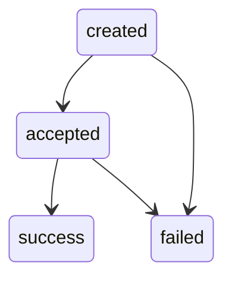

## Overview

A Pix Outflow represents an outgoing Pix payment sent on behalf of a user. You initiate outflows via the API and track their progress through event logs.

## Lifecycle

Pix Outflows are processed asynchronously. You request a payment via the API and track its progress through event logs. Each state transition produces a `pix_outflow` event with a `PixOutflowLog` payload.

## State Machine

## Log States

| State      | Description                          | Nullable fields                                                                    |
| ---------- | ------------------------------------ | ---------------------------------------------------------------------------------- |
| `created`  | Outflow created, pending processing. | `amount_cents`, `end_to_end_id`, `method`, `failure_reason`, receiver fields are `null` |
| `accepted` | Outflow accepted for processing.     | `end_to_end_id`, `failure_reason`, receiver fields may be `null`                   |
| `success`  | Payment successfully completed.      | `failure_reason` is `null`. All other fields present                               |
| `failed`   | Payment processing failed.           | `end_to_end_id`, receiver fields may be `null`. `failure_reason` present           |

## PixOutflowLog Object

| Field                    | Type             | Description                                                        |
| ------------------------ | ---------------- | ------------------------------------------------------------------ |
| `id`                     | string (UUIDv7)  | Unique log identifier.                                             |
| `resource_id`            | string           | Outflow resource identifier.                                       |
| `end_to_end_id`          | string or null   | Central Bank end-to-end identifier for the transaction.            |
| `sender_user_id`         | string (UUIDv4)  | User who sent the payment.                                         |
| `kind`                   | string           | Log state: `created`, `accepted`, `success`, `failed`.             |
| `amount_cents`           | integer or null  | Payment amount in cents (BRL).                                     |
| `method`                 | string or null   | Payment method used.                                               |
| `failure_reason`         | string or null   | Reason for failure, present in `failed` logs.                      |
| `receiver_bank_code`     | string or null   | Receiver's bank ISPB code.                                         |
| `receiver_branch_code`   | string or null   | Receiver's branch code.                                            |
| `receiver_account_number`| string or null   | Receiver's account number.                                         |
| `receiver_account_type`  | string or null   | Receiver's account type: `checking`, `savings`, `payment`, `salary`. |
| `created_at`             | integer          | Unix timestamp when the log was created.                           |
| `timestamp`              | integer          | Unix timestamp of the state transition.                            |
