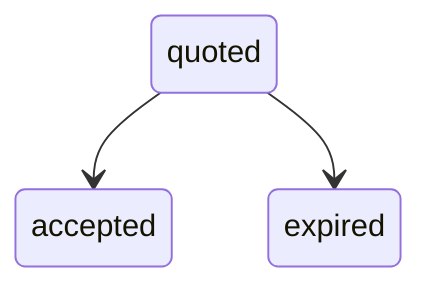

## Overview

A Trade represents a buy or sell operation of a supported asset (USDT, BTC) on behalf of a user. You request a quote via the API and accept it before it expires. Each state transition produces a `trade` event with a `TradeLog` payload.

## Lifecycle

Trades follow a quote-then-accept flow. You first request a quote, then accept it before expiration. Each state transition produces a `trade` event with a `TradeLog` payload.

## State Machine

## Log States

| State      | Description                          | Nullable fields                                                                          |
| ---------- | ------------------------------------ | ---------------------------------------------------------------------------------------- |
| `quoted`   | Quote created, awaiting acceptance.  | `asset`, `side`, `quantity`, `price_cents`, `cents_gross`, `cents_net`, `cents_fee` may be `null` |
| `accepted` | Quote accepted, trade executed.      | All fields present                                                                       |
| `expired`  | Quote expired before acceptance.     | `asset`, `side`, `quantity`, `price_cents`, `cents_gross`, `cents_net`, `cents_fee` may be `null` |

## TradeLog Object

| Field         | Type            | Description                              |
| ------------- | --------------- | ---------------------------------------- |
| `id`          | string          | Unique log identifier.                   |
| `user_id`     | string (UUIDv4) | User who initiated the trade.            |
| `kind`        | string          | Log state: `quoted`, `accepted`, `expired`. |
| `asset`       | string or null  | Traded asset: `usdt`, `btc`.             |
| `side`        | string or null  | Trade direction: `buy`, `sell`.          |
| `quantity`    | integer or null | Asset quantity in the smallest unit.     |
| `price_cents` | integer or null | Unit price in cents (BRL).               |
| `cents_gross` | integer or null | Gross amount in cents (BRL).             |
| `cents_net`   | integer or null | Net amount in cents (BRL) after fees.    |
| `cents_fee`   | integer or null | Fee amount in cents (BRL).               |
| `created_at`  | integer         | Unix timestamp when the log was created. |
| `timestamp`   | integer         | Unix timestamp of the state transition.  |
