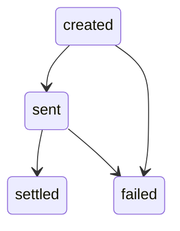

## Overview

A USDT Withdrawal represents an outbound transfer of USDT to an external blockchain address. Each state transition produces a `usdt_withdrawal` event with a `UsdtWithdrawalLog` payload.

## Lifecycle

USDT Withdrawals are created via the API and processed asynchronously on-chain. You track progress through event logs delivered to your webhook. Each state transition produces a `usdt_withdrawal` event with a `UsdtWithdrawalLog` payload.

## State Machine

States from `UsdtWithdrawalLogKind`: `created`, `sent`, `settled`, `failed`.

## Log States

| State | Description | Nullable fields |
|-------|------------|-----------------|
| `created` | Withdrawal request created, pending processing. | `amount_usdtmicros`, `blockchain_address`, `network`, `tx_hash` may be `null` |
| `sent` | Transaction broadcast to the blockchain. | `tx_hash` may be `null` |
| `settled` | Transaction confirmed on-chain. | All fields present |
| `failed` | Withdrawal failed. | `tx_hash` may be `null` |

## UsdtWithdrawalLog Object

From the OpenAPI `UsdtWithdrawalLog` schema:

| Field | Type | Description |
|-------|------|-------------|
| `id` | string | Unique log identifier. |
| `user_id` | string (UUIDv4) | User who initiated the withdrawal. |
| `kind` | string | Log state: `created`, `sent`, `settled`, `failed`. |
| `amount_usdtmicros` | integer or null | Withdrawal amount in USDT micros. |
| `blockchain_address` | string or null | Destination blockchain address. |
| `network` | string or null | Blockchain network used. |
| `tx_hash` | string or null | On-chain transaction hash. |
| `created_at` | integer | Unix timestamp when the log was created. |
| `timestamp` | integer | Unix timestamp of the state transition. |
