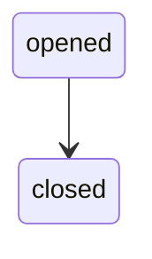

## Overview

A User represents an end-user account managed through the API. Each state transition produces a `user` event with a `UserLog` payload.

## Lifecycle

Users are created via the API and can be closed. Each state transition produces a `user` event with a `UserLog` payload delivered to your webhook.

## State Machine

States from `UserLogKind`: `opened`, `closed`.

## Log States

| State | Description | Nullable fields |
|-------|------------|-----------------|
| `opened` | User account opened. | `account_branch_code`, `account_digit`, `account_full_number` may be `null` |
| `closed` | User account closed. | `account_branch_code`, `account_digit`, `account_full_number` may be `null` |

## UserLog Object

From the OpenAPI `UserLog` schema:

| Field | Type | Description |
|-------|------|-------------|
| `id` | string | Unique log identifier. |
| `user_id` | string (UUIDv4) | The user's identifier. |
| `kind` | string | Log state: `opened`, `closed`. |
| `account_branch_code` | string or null | User's account branch code. |
| `account_digit` | integer or null | User's account check digit. |
| `account_full_number` | integer or null | User's full account number. |
| `created_at` | integer | Unix timestamp when the log was created. |
| `timestamp` | integer | Unix timestamp of the state transition. |
