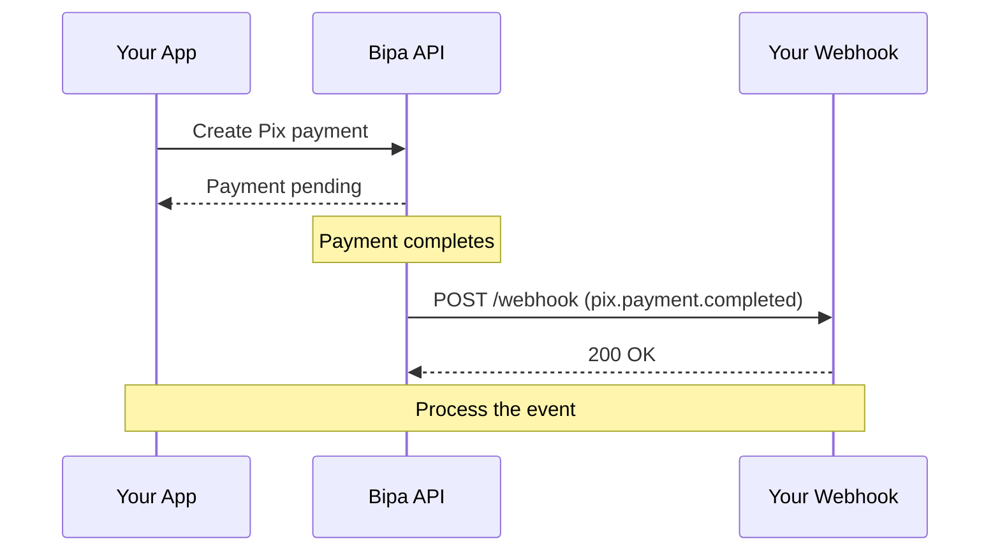

## Overview

Webhooks allow you to receive HTTP callbacks when events occur in your Bipa account. Instead of polling the API, you can react to events in real-time.



## Setting up webhooks

1. Go to **Settings** → **Webhooks** in your [dashboard](https://dashboard.bipa.app)
2. Click **Add endpoint**
3. Enter your webhook URL (must be HTTPS)
4. Select the events you want to receive
5. Copy the signing secret for verification

## Webhook payload structure

All webhook events follow this structure:

```json
{
  "id": "evt_a1b2c3d4e5f6",
  "type": "pix.payment.completed",
  "created_at": "2024-01-15T10:30:00Z",
  "data": {
    "object": {
      "id": "pix_pay_xyz789",
      "customer_id": "cus_a1b2c3d4e5f6",
      "amount_cents": 100000,
      "status": "completed"
      // ... full object data
    }
  }
}
```

| Field | Type | Description |
|-------|------|-------------|
| `id` | string | Unique identifier for this event |
| `type` | string | The event type (e.g., `pix.payment.completed`) |
| `created_at` | string | ISO 8601 timestamp of when the event occurred |
| `data.object` | object | The full object associated with the event |

## Event types

### Customer events

| Event | Description |
|-------|-------------|
| `customer.created` | A new customer was created |
| `customer.updated` | Customer information was updated |

### Pix events

| Event | Description |
|-------|-------------|
| `pix.payment.received` | Incoming Pix payment received (cash-in) |
| `pix.payment.completed` | Outgoing Pix payment completed (cash-out) |
| `pix.payment.failed` | Pix payment failed |

### Trade events

| Event | Description |
|-------|-------------|
| `trade.completed` | A trade was successfully executed |
| `trade.failed` | A trade failed to execute |

### On-chain events

| Event | Description |
|-------|-------------|
| `onchain.deposit.pending` | Deposit detected, awaiting confirmations |
| `onchain.deposit.confirmed` | Deposit confirmed and credited |
| `onchain.withdrawal.completed` | Withdrawal successfully sent |
| `onchain.withdrawal.failed` | Withdrawal failed |

### Lightning events

| Event | Description |
|-------|-------------|
| `lightning.invoice.paid` | Lightning invoice was paid |
| `lightning.payment.completed` | Outgoing Lightning payment completed |
| `lightning.payment.failed` | Lightning payment failed |

## Verifying webhook signatures

Every webhook request includes a signature in the `X-Bipa-Signature` header. **Always verify this signature** to ensure the request came from Bipa.

The signature is an HMAC-SHA256 hash of the request body using your webhook signing secret.

<CodeGroup>

```python Python
import hmac
import hashlib

def verify_webhook(payload: bytes, signature: str, secret: str) -> bool:
    expected = hmac.new(
        secret.encode(),
        payload,
        hashlib.sha256
    ).hexdigest()

    return hmac.compare_digest(f"sha256={expected}", signature)

# In your webhook handler
@app.post("/webhook")
def handle_webhook(request):
    payload = request.body
    signature = request.headers.get("X-Bipa-Signature")

    if not verify_webhook(payload, signature, WEBHOOK_SECRET):
        return Response(status=401)

    event = json.loads(payload)
    # Process the event
    return Response(status=200)
```

```javascript Node.js
const crypto = require("crypto");

function verifyWebhook(payload, signature, secret) {
  const expected = crypto
    .createHmac("sha256", secret)
    .update(payload)
    .digest("hex");

  return crypto.timingSafeEqual(
    Buffer.from(`sha256=${expected}`),
    Buffer.from(signature)
  );
}

// Express.js example
app.post("/webhook", express.raw({ type: "application/json" }), (req, res) => {
  const signature = req.headers["x-bipa-signature"];

  if (!verifyWebhook(req.body, signature, WEBHOOK_SECRET)) {
    return res.status(401).send("Invalid signature");
  }

  const event = JSON.parse(req.body);
  // Process the event
  res.status(200).send("OK");
});
```

```go Go
import (
    "crypto/hmac"
    "crypto/sha256"
    "encoding/hex"
)

func verifyWebhook(payload []byte, signature, secret string) bool {
    mac := hmac.New(sha256.New, []byte(secret))
    mac.Write(payload)
    expected := "sha256=" + hex.EncodeToString(mac.Sum(nil))

    return hmac.Equal([]byte(expected), []byte(signature))
}
```

</CodeGroup>

<Warning>
  Never process webhook events without verifying the signature. Attackers could forge requests to your endpoint.
</Warning>

## Handling webhooks

### Respond quickly

Return a `2xx` status code within **30 seconds**. If your processing takes longer, acknowledge the webhook first and process asynchronously.

```python
@app.post("/webhook")
async def handle_webhook(request):
    event = await request.json()

    # Queue for async processing
    await queue.enqueue(process_event, event)

    # Respond immediately
    return Response(status=200)
```

### Handle duplicates

Webhook events may be delivered more than once. Use the `id` field to deduplicate:

```python
def handle_event(event):
    # Check if we've already processed this event
    if redis.get(f"webhook:{event['id']}"):
        return  # Already processed

    # Process the event
    process_event(event)

    # Mark as processed (with TTL)
    redis.setex(f"webhook:{event['id']}", 86400, "1")
```

### Implement idempotency

Design your handlers to produce the same result even if called multiple times with the same event.

## Retry policy

If your endpoint returns a non-`2xx` status or times out, Bipa will retry the webhook:

| Attempt | Delay |
|---------|-------|
| 1 | Immediate |
| 2 | 5 minutes |
| 3 | 30 minutes |
| 4 | 2 hours |
| 5 | 8 hours |
| 6 | 24 hours |

After 6 failed attempts, the webhook is marked as failed. You can view failed webhooks and manually retry them in the dashboard.

## Testing webhooks

### Using the dashboard

1. Go to **Settings** → **Webhooks**
2. Select your endpoint
3. Click **Send test event**
4. Choose an event type to send

### Local development

Use a tunneling service like [ngrok](https://ngrok.com) to expose your local server:

```bash
ngrok http 3000
```

Then add the ngrok URL as a webhook endpoint in test mode.

## Example: Processing a Pix payment

```python
@app.post("/webhook")
def handle_webhook(request):
    # Verify signature
    if not verify_webhook(request.body, request.headers.get("X-Bipa-Signature"), SECRET):
        return Response(status=401)

    event = request.json()

    match event["type"]:
        case "pix.payment.received":
            payment = event["data"]["object"]

            # Credit the user's account in your system
            user = get_user_by_customer_id(payment["customer_id"])
            credit_user_balance(user, payment["amount_cents"])

            # Send notification
            send_notification(user, f"Received R$ {payment['amount_cents'] / 100:.2f} via Pix")

        case "pix.payment.failed":
            payment = event["data"]["object"]

            # Handle the failure
            notify_payment_failure(payment)

    return Response(status=200)
```

## Webhook logs

View all webhook deliveries in **Settings** → **Webhooks** → **Logs**. Each log entry shows:

- Event type and ID
- Delivery status (success/failed)
- Response status code
- Response time
- Request and response bodies

